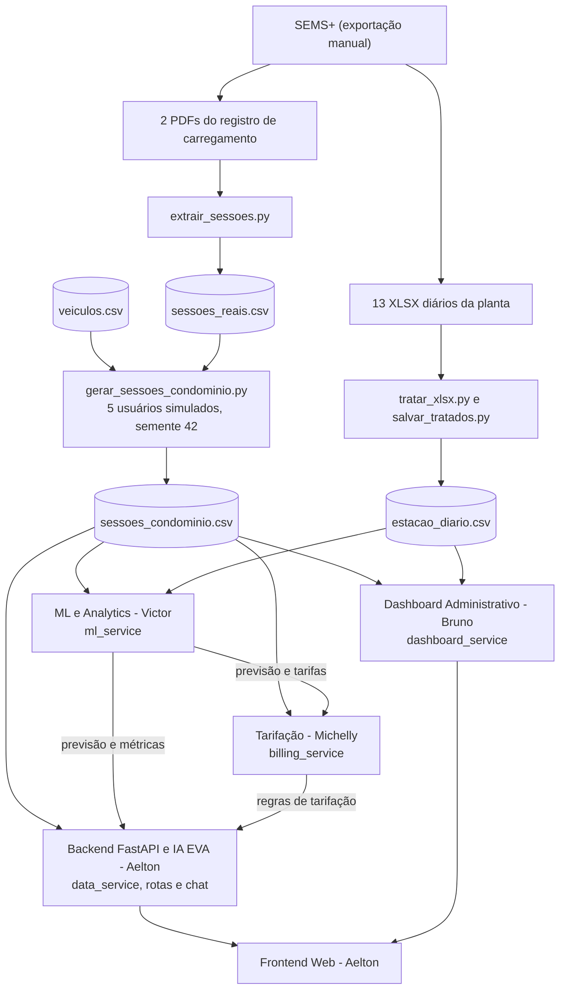
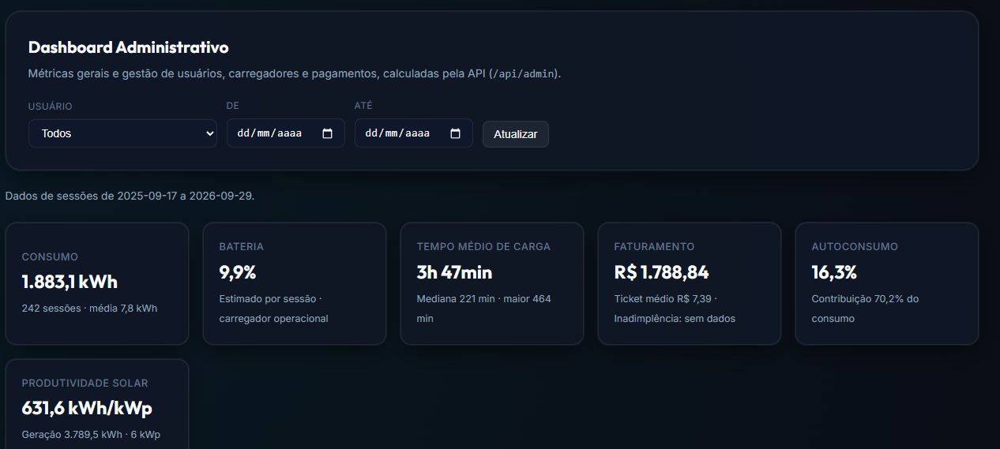
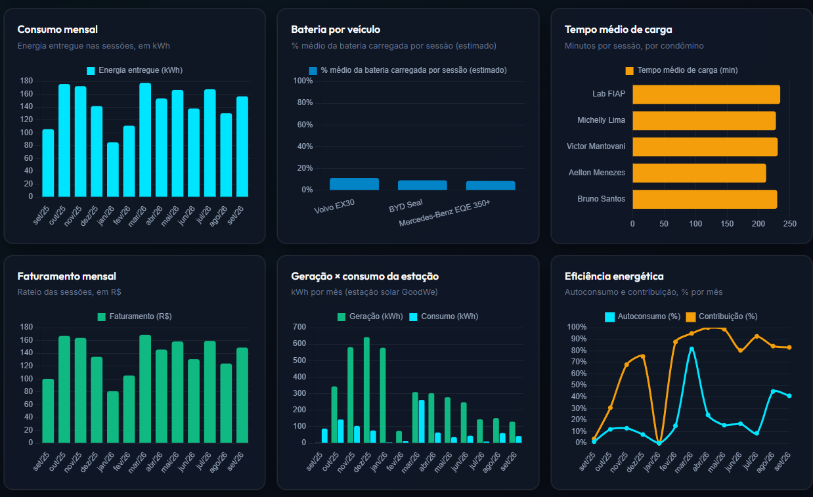
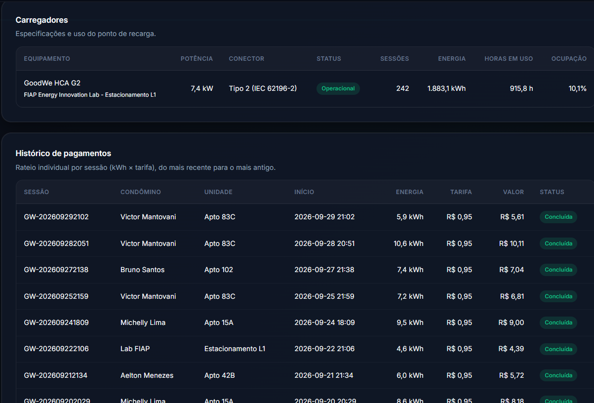

# EV ChargeOps | GoodWe + FIAP
## Plataforma de Gestão, Rateio Individual e IA Conversacional para Recarga de Veículos Elétricos

> **Enterprise Challenge 2026** - FIAP & GoodWe (Energy Innovation Lab - Estacionamento L1)  
> **Equipe:** `{Dev}Lounge`

### Integrantes da Equipe
- **Aelton Soares de Menezes** (RM: 573694) - *Backend REST API, IA EVA & Frontend Web*
- **Victor Mantovani** (RM: 570608) - *Machine Learning & Analytics*
- **Michelly Santos** (RM: 573625) - *Sistema de Tarifação & Simulação de Pagamentos*
- **Bruno Santos** (RM: 572073) - *Dashboard Administrativo, Gestão & Documentação*

> Maria (RM 572267) participou da Sprint 01 e não integra a equipe na Sprint 02.

---

## 1. Visão Geral da Solução

O **EV ChargeOps** é uma plataforma de software desenvolvida para solucionar os principais desafios da recarga compartilhada de veículos elétricos em condomínios residenciais e frotas corporativas.

Integrada aos dados do carregador **GoodWe HCA G2** instalado no **Energy Innovation Lab da FIAP**, a solução transforma telemetria bruta em:
1. **Faturamento Justo e Individualizado:** Rateio baseado estritamente na energia consumida em quilowatt-hora ($\text{Fatura} = \text{kWh} \times \text{Tarifa}$), eliminando divisões genéricas na taxa de condomínio;
2. **Inteligência Artificial Conversacional (IA EVA):** Assistente virtual com injeção dinâmica de contexto para tirar dúvidas de autonomia, custos e status da bateria;
3. **Simulador Paramétrico de Recarga:** Ferramenta interativa que correlaciona tempo de conexão, energia necessária e valor financeiro;
4. **Machine Learning & Analytics:** Análise do perfil de uso, previsão de demanda por dia da semana e precificação dinâmica por horário de início da recarga;
5. **Dashboard Administrativo:** Painel gerencial com consumo, faturamento, eficiência energética, usuários, carregadores e pagamentos;
6. **Arquitetura Modular em FastAPI:** API REST escalável com documentação OpenAPI (`/docs`), servindo nativamente a interface web.

---

## 2. Decisões Técnicas e Desvios de Escopo (Sprint 01 → Sprint 02)

Para garantir um protótipo com código 100% autoral, robusto e compatível com as rubricas da FIAP, foram adotadas as seguintes decisões (registradas no documento `docs/Decisões Sprint 2.md`):

| Decisão / Desvio | Motivação & Limitação Técnica | Solução Implementada |
| :--- | :--- | :--- |
| **Backend autoral em Python/FastAPI, sem plataformas low-code** | Ferramentas low-code (como n8n) ocultam regras de negócio, geram dependência externa e enfraquecem a comprovação de autoria exigida na FIAP. A Sprint 01 já previa FastAPI, e a decisão foi mantida. | API autoral em **FastAPI**, com rotas documentadas (`/docs`), validação via Pydantic e execução assíncrona de alta performance. |
| **Ingestão por exportação manual do SEMS+ (em vez de API)** | Conforme a apresentação da GoodWe, não há suporte de API para os EV Chargers (a consulta é do tipo *pull*, sem tempo real). O que foi liberado é o acesso à planta de monitoramento no SEMS+. | 13 relatórios mensais em **XLSX** (set/2025 a set/2026) e 2 **PDFs** com o registro de carregamento, tratados por scripts Python em `backend/scripts/data_scripts`. |
| **Dados da estação em formato diário e agregado** | Os XLSX são o relatório diário da planta inteira. Não trazem sessão, usuário, veículo nem horário de uso. | `estacao_diario.csv` (395 dias x 13 indicadores) é usado como série de contexto. As sessões vêm do registro de carregamento do SEMS+. |
| **Usuários e veículos simulados sobre sessões reais** | As sessões reais vêm de um único carregador e de um único cartão RFID. Não há dados de vários moradores nem do modelo do carro. | `gerar_sessoes_condominio.py` atribui cada sessão real a um de 5 usuários simulados, com 3 modelos do catálogo (Mercedes-Benz EQE 350+, BYD Seal e Volvo EX30), por sorteio com semente fixa (42). Horários, kWh e durações são reais. Usuário e veículo são simulados. |
| **Persistência em CSV (tabelas) e JSON (metadados) no lugar do PostgreSQL** | A Sprint 01 previa PostgreSQL. O volume do protótipo é pequeno (242 sessões, 5 usuários) e os dados são somente leitura, então um SGBD acrescentaria instalação sem ganho na demonstração. | `estacao_diario.csv`, `sessoes_reais.csv`, `sessoes_condominio.csv` e `veiculos.csv` em `backend/data`. O JSON guarda os metadados do condomínio (`ev_chargeops_data.json`, com valores padrão no `data_service` quando o arquivo não existe). |
| **Tarifa como parâmetro do sistema** | Os valores em R$ dos XLSX usam uma tarifa fixa de R$ 1,00 por kWh, que não representa uma tarifa real. | `DEFAULT_RATE_PER_KWH` em `config.py` (R$ 0,95, configurável por `.env`). Valor provisório, a confirmar com o grupo. |
| **Potência e tempo de recarga calibrados com dados reais** | O carregador de referência é de 7 kW, mas nas sessões reais a potência média foi de cerca de 2,1 kW. Usar a potência nominal subestima o tempo de recarga em cerca de 3 vezes. | O simulador usa uma relação calibrada nas 242 sessões reais: tempo (h) = 0,94 + 0,366 x kWh (R² 0,86, erro médio de 22 minutos), com a potência nominal como piso físico. |
| **IA EVA com injeção de contexto no lugar de RAG com LangChain** | Ver seção 2.1. | Injeção dinâmica do perfil do morador, veículo cadastrado, tarifa e histórico das sessões diretamente no prompt da IA. |
| **Descontinuação da conexão direta aos carregadores** | Restrições logísticas de rede local e segurança no Energy Innovation Lab da FIAP (Estacionamento L1). | O controle e a simulação das sessões operam sobre o fluxo de dados coletados, desacoplados do acionamento físico. |
| **Substituição de RFID / Bluetooth por simulação lógica de sessão e checkout** | Limitações de disponibilidade de hardware dedicado (leitores e tags) e complexidade de integração embarcada na fase atual. | Identificação do usuário, autorização de recarga e checkout simulados via interface web integrada à API. |
| **Dashboard em código, sem ferramenta de BI** | Mesmo motivo da escolha por código autoral: manter a regra de negócio no código do grupo. | Dashboard em FastAPI + Chart.js (ver seção 8.5). |
| **Frontend em HTML, CSS e JavaScript no lugar de React e React Native** | A Sprint 01 previa React (gestor) e React Native (morador). Um frontend sem build, servido pelo próprio FastAPI, roda em um único processo e sem Node.js. | Aplicação web responsiva em `frontend/`, com as abas do morador e do gestor na mesma página. Não há app mobile nativo. |
| **Pagamento simulado no lugar de gateway (Stripe ou PIX)** | Integração real exige conta, credenciais e homologação, fora do escopo do protótipo. | `POST /api/billing/checkout` gera um comprovante simulado com a tarifa do horário. O botão de autorização do simulador chama essa rota. |
| **Login, notificações e acessibilidade não implementados** | Dependem de banco de dados e cadastro, de um canal de envio e de tempo que foi priorizado para rateio e IA. | Ficam como evolução. |

### 2.1. Desvios do Módulo de Inteligência Artificial

A Sprint 01 definiu duas IAs: a **IA de Controle Operacional** (previsão de consumo por regressão, estimativa de tempo restante e detecção de anomalias) e a **IA EVA** (RAG sobre uma base de conhecimento fechada).

| Plano da Sprint 01 | O que foi implementado | Justificativa |
| :--- | :--- | :--- |
| **Previsão de consumo por regressão (scikit-learn)** | Previsão diária por **mediana de kWh por dia da semana**, validada por data (seção 6.3). | As sessões trazem só data, hora, duração e kWh, de um único cartão RFID. Sem outras variáveis explicativas, o único sinal é o calendário, e a demanda é intermitente. Nesse cenário a mediana teve o menor erro entre as seis variantes testadas, então o grupo optou por um modelo simples e explicável. |
| **Previsão da fatura mensal de cada usuário** | Não implementada. A previsão é do total diário da estação. | Os usuários são simulados por sorteio sobre as sessões de um único cartão. O histórico por usuário não tem padrão próprio para ser aprendido. |
| **IA alimentando o motor de rateio** | **Implementado.** A precificação dinâmica (seção 6.4) aprende a janela de pico com as sessões reais e define a tarifa por horário que o `billing_service` usa em `/calculate`, `/simulate` e `/checkout`. | É o papel estrutural da IA no fluxo: a saída do modelo define o valor por kWh da fórmula `Fatura = kWh x Tarifa`. |
| **Estimativa do tempo restante de carga** | Relação calibrada nas sessões reais (tempo = 0,94 + 0,366 x kWh), usada no simulador. | Não há telemetria em tempo real, então a estimativa é feita antes da sessão, a partir da energia desejada. |
| **Detecção de anomalias** | **Não implementada.** A qualidade dos dados é tratada por regras fixas na extração (sessões abaixo de 0,5 kWh e as 6 sessões sem cartão ficam de fora, seção 10.3). | A exportação do SEMS+ não traz eventos de erro, interrupção ou falha do equipamento. Com um único carro e sem anomalias confirmadas, não haveria como validar um detector. Fica como evolução quando houver telemetria por sessão. |
| **EVA com RAG (LangChain) sobre manual do HCA G2, regulamento interno e documentação do rateio** | Injeção de contexto no prompt (seção 3.3), com fallback para um motor de regras sem chave da OpenAI. | O regulamento interno não existe (o condomínio é simulado) e o conteúdo necessário cabe inteiro no prompt, então não há o que recuperar por busca vetorial. A injeção de contexto restringe as respostas aos dados da plataforma sem depender de LangChain e de banco vetorial. |

---

## 3. Módulo 1: Backend REST API & IA EVA (Aelton Soares)

### 3.1. Arquitetura da API REST (`/backend/app`)
Construída com **Python 3**, **FastAPI** e **Uvicorn**, a API centraliza as regras de negócio e expõe documentação interativa Swagger UI em `/docs`:

- **Modularidade de Rotas:**
  - `/api/chat`: Processamento de linguagem natural com a IA EVA e sugestão de perguntas frequentes;
  - `/api/sessions`: Listagem sanitizada do histórico de recargas e agregações de telemetria (`/metrics`);
  - `/api/billing`: Cálculo oficial de rateio por kWh, decomposição de custos e simulador paramétrico;
  - `/api/analytics`: Integração com os modelos de Machine Learning (Victor);
  - `/api/admin`: Métricas executivas e gestão de condomínio (Bruno);
  - `/health` e `/api/status`: Verificação de integridade e metadados operacionais.
- **Servidor Web Integrado:** A API monta e serve automaticamente os arquivos estáticos da interface web na raiz (`/`).

### 3.2. Pipeline de Ingestão de Dados (`sessoes_condominio.csv`)
A fonte das sessões de recarga é o arquivo `backend/data/tratados/sessoes_condominio.csv`, gerado a partir do registro de carregamento do SEMS+ do carregador GoodWe (ver seção 6.1). O arquivo `estacao_diario.csv` (**395 dias** de dados da planta) fica como série de contexto:
- O `DataService` lê as **242 sessões** do condomínio (caminho `SESSIONS_CSV_PATH` em `config.py`; o caminho `STATION_CSV_PATH` aponta para o arquivo da estação);
- Converte cada linha em uma sessão de recarga com identificador único, data/hora, condômino, veículo elétrico, duração e valor do rateio;
- Alimenta os KPIs em tempo real:
  - **Energia Total Registrada:** `1883.12 kWh`
  - **Faturamento Total:** `R$ 1788.84` (tarifa de R$ 0,95/kWh)
  - **Total de Sessões:** `242 recargas concluídas`

> Os valores de energia e de faturamento vêm das sessões. A coluna `energia_carregada_kwh` da estação (387,2 kWh) **não** é recarga de veículos e não entra nesses KPIs (ver seção 10.2).

### 3.3. IA EVA - Assistente Virtual Inteligente
A **EVA** (*Energy Virtual Assistant*) foi desenvolvida com arquitetura de alta resiliência (*Dual Engine*):

1. **Modo Conectado (OpenAI GPT-4o-mini):** Quando uma chave `OPENAI_API_KEY` válida é configurada no arquivo `.env`, as respostas são formuladas dinamicamente via LLM com injeção de contexto em tempo real;
2. **Modo Especialista Autônomo (Offline Engine):** Caso a API externa esteja indisponível ou sem chave configurada, um motor especialista baseado em regras técnicas entra em ação imediatamente, garantindo que o protótipo nunca falhe na avaliação.

**Consultas Obrigatórias Suportadas em Linguagem Natural:**
- *“Quantas horas o carro aguenta com a bateria atual?”* → Calcula a autonomia estimada com base na capacidade da bateria do veículo cadastrado (ex: 82,5 kWh do BYD Seal);
- *“Quantos kWh faltam para completar a carga?”* → Calcula o volume em kWh, o tempo e o custo pelo simulador calibrado do `billing_service` (o mesmo da aba Simulador);
- *“Qual será o custo estimado da recarga?”* → Aplica a fórmula oficial de rateio com a tarifa do horário atual e compara o custo no pico e fora dele;
- *“Como funciona o modelo de rateio por kWh?”* → Explica os pilares da cobrança individualizada e a tarifa por horário;
- *“Qual o melhor horário para carregar?”* → Responde com a janela de pico e as tarifas calculadas pelo `ml_service` (precificação dinâmica);
- *“Por que minha fatura subiu este mês?”* → Compara os dois últimos meses com recargas do morador (sessões, kWh e valor).

No Modo Conectado, o prompt da EVA recebe os mesmos dados: perfil e veículo do morador, consumo dos últimos meses, tarifas de pico e fora do pico, tarifa vigente e a previsão de demanda dos próximos 7 dias.

### 3.4. Frontend Web Centralizador (`/frontend`)
Aplicação Web responsiva desenvolvida em **HTML5**, **CSS3 (Vanilla)** e **JavaScript modular**, sem frameworks externos pesados:
- **Tema Escuro (Dark Mode):** Visual premium com glassmorphism, paleta curada e tipografia moderna (*Outfit* e *Inter*);
- **Header Informativo:** Seletor de unidade/apartamento (ex: `Apto 42B`) e indicador de status de conexão com a API em tempo real;
- **Painel de KPIs:** Exibição dinâmica da energia entregue, faturamento acumulado, especificações do carregador GoodWe e tarifa ativa;
- **Aba IA EVA:** Chat interativo com histórico, botões de perguntas rápidas e indicador de digitação;
- **Aba Simulador de Recarga:** Sliders interativos de SoC inicial e final (%), cálculo instantâneo de kWh necessários, tempo estimado de carga e botão de simulação de autorização/pagamento;
- **Aba Telemetria GoodWe:** Tabela com paginação e histórico das 242 sessões;
- **Aba Dashboard Administrativo:** Métricas, gráficos e painel de consulta (ver seção 8).

---

## 4. Instruções de Instalação e Execução

### Pré-requisitos
- **Python 3.10 ou superior** instalado;
- Gerenciador de pacotes **pip** ou **uv**.

### Passo a Passo de Execução

1. **Clone o repositório:**
   ```bash
   git clone https://github.com/DevLounge-FIAP/EV_ChargeOps.git
   cd EV_ChargeOps
   ```

2. **Configure o arquivo de ambiente (Opcional para a IA OpenAI):**
   ```bash
   cp backend/.env.example backend/.env
   ```
   *(Caso deseje usar a OpenAI, insira sua `OPENAI_API_KEY` no arquivo `backend/.env`. Se não configurar, o sistema usará o motor especialista autônomo sem nenhum prejuízo às funcionalidades).*

3. **Instale as dependências:**
   ```bash
   pip install -r backend/requirements.txt
   ```
   *Ou utilizando o uv (rápido e automatizado):*
   ```bash
   uv run --directory backend --with-requirements requirements.txt python run.py
   ```

4. **Inicie o servidor Backend:**
   ```bash
   python backend/run.py
   ```

5. **Acesse a aplicação no navegador:**
   - **Interface Web:** [http://localhost:8000/](http://localhost:8000/)
   - **Documentação Swagger (OpenAPI):** [http://localhost:8000/docs](http://localhost:8000/docs)
   - **Documentação Redoc:** [http://localhost:8000/redoc](http://localhost:8000/redoc)

> Alternativa com um comando só: `iniciar.bat` (Windows) ou `bash iniciar.sh` (Git Bash, Linux ou Mac). Detalhes na seção 8.6.

### Variáveis de Ambiente (`backend/.env`)

| Variável | Padrão | Função |
| :--- | :--- | :--- |
| `OPENAI_API_KEY` | vazio | Ativa o Modo Conectado da IA EVA. Sem ela, vale o motor especialista autônomo |
| `OPENAI_MODEL` | `gpt-4o-mini` | Modelo usado pela EVA no Modo Conectado |
| `DEFAULT_RATE_PER_KWH` | `0.95` | Tarifa base do rateio (R$/kWh) |
| `HOST` e `PORT` | `0.0.0.0` e `8000` | Endereço e porta do servidor |

---

## 5. Estrutura de Integração entre os Módulos

O backend foi organizado com pontos de conexão dedicados para que cada integrante conecte sua respectiva parte de forma simples e independente:

```
EV_ChargeOps/
├── backend/
│   ├── app/
│   │   ├── api/
│   │   │   ├── routes_chat.py       # [Aelton] Rotas da IA EVA
│   │   │   ├── routes_sessions.py   # [Aelton] Histórico de sessões e telemetria
│   │   │   ├── routes_billing.py    # [Michelly] Tarifação e simulação de checkout
│   │   │   ├── routes_analytics.py  # [Victor] Previsão de demanda e precificação dinâmica
│   │   │   └── routes_admin.py      # [Bruno] Métricas administrativas e gestão
│   │   ├── services/
│   │   │   ├── ai_eva_service.py    # [Aelton] Lógica conversacional da EVA
│   │   │   ├── data_service.py      # [Aelton] Leitura e sanitização dos CSV tratados
│   │   │   ├── billing_service.py   # [Michelly] Motor de rateio e pagamentos
│   │   │   ├── ml_service.py        # [Victor] Modelo de demanda e precificação dinâmica
│   │   │   └── dashboard_service.py # [Bruno] Métricas do dashboard (pandas)
│   │   ├── schemas/models.py        # Modelos Pydantic de entrada e saída
│   │   ├── main.py                  # Ponto central da API e servidor do Frontend
│   │   └── config.py                # Configurações gerais da aplicação
│   ├── data/
│   │   ├── brutos/                  # Exportações originais do SEMS+ (13 XLSX e 2 PDF)
│   │   ├── tratados/                # estacao_diario.csv, sessoes_reais.csv e sessoes_condominio.csv
│   │   └── referencia/veiculos.csv  # Catálogo de veículos (3 modelos)
│   ├── notebooks/                   # [Victor] Análise temporal e modelo de demanda
│   ├── scripts/data_scripts/        # [Victor] Tratamento dos dados do SEMS+
│   └── tests/                       # [Bruno] Testes automáticos do dashboard
├── frontend/                        # Interface web (HTML, CSS e JavaScript)
├── docs/                            # Documentação da Sprint 01 e Sprint 02
├── imagens/                         # Evidências e diagramas
├── iniciar.bat / iniciar.sh         # Execução com um comando
└── README.md
```

### Fluxo de Dados



> O diagrama `imagens/diagrama_arquitetura.png` é o fluxo planejado na Sprint 01. Em relação a ele, a Sprint 02 não usa banco de dados (os dados ficam em CSV e JSON) e não implementou a detecção de anomalias (justificativas na seção 2).

---

## 6. Módulo 2: Machine Learning & Analytics (Victor Mantovani)

O módulo de ML analisa o padrão de uso do carregador, prevê a demanda diária de energia e propõe uma tarifa que incentiva a recarga fora do horário de pico. A lógica fica em `backend/app/services/ml_service.py` e é exposta em `/api/analytics`. A comparação completa entre os modelos testados está em `backend/notebooks/02_modelo_demanda.ipynb`.

### 6.1. Tratamento dos Dados (`backend/scripts/data_scripts`)

| Script | O que faz |
| :--- | :--- |
| `tratar_xlsx.py` e `salvar_tratados.py` | Tratam os 13 XLSX mensais do SEMS+ e geram `estacao_diario.csv` (395 dias x 13 indicadores) |
| `extrair_sessoes.py` | Extrai as sessões de recarga dos 2 PDFs do registro de carregamento e gera `sessoes_reais.csv` (266 sessões, 247 válidas com pelo menos 0,5 kWh, 1.960,91 kWh) |
| `gerar_sessoes_condominio.py` | Atribui cada sessão real a um dos 5 usuários simulados e a um dos 3 veículos do catálogo (semente 42) e gera `sessoes_condominio.csv`, com 242 sessões |

O catálogo `backend/data/referencia/veiculos.csv` reúne bateria total, autonomia no ciclo Inmetro e consumo oficial (PBE Veicular) de **Mercedes-Benz EQE 350+** (96 kWh), **BYD Seal** (82,5 kWh) e **Volvo EX30 Plus Extended Range** (69 kWh).

> Horários, kWh e durações das sessões são reais. Usuário e veículo são simulados.

### 6.2. Análise Temporal (`01_analise_temporal.ipynb`)

Base: 242 sessões reais do carregador GoodWe (17/09/2025 a 29/09/2026), de um único carro e um único cartão RFID.

| Aspecto | Resultado |
| :--- | :--- |
| **Hora** | 88% das sessões começam entre 17h e 23h. As 20h e 21h concentram 57% das sessões e 57% da energia |
| **Dia da semana** | Só o sábado se destaca (mediana de 0 kWh, com 74% dos sábados sem recarga). Os demais dias são parecidos entre si |
| **Mês** | De março a setembro/2026 a demanda é estável (cerca de 5,1 kWh por dia). Dezembro a fevereiro foram mais baixos, mas há uma única observação de cada mês, então não é possível afirmar sazonalidade |
| **Perfil por sessão** | Energia média de 7,8 kWh e duração média de cerca de 3,8 horas. A potência média ficou em torno de 2,05 kW |
| **Intermitência** | Entre 30% e 41% dos dias de semana não têm recarga, o que dificulta a previsão |

### 6.3. Modelo de Previsão de Demanda

**Modelo final:** mediana de kWh por dia da semana, calculada sobre os **378 dias** de sessões (sem recarga conta como 0 kWh). Cada data futura recebe a mediana histórica do seu dia da semana, então a previsão não depende do que aconteceu "ontem" e vale para qualquer horizonte (1 a 30 dias).

**Validação por data:** treino de 17/09/2025 a 31/05/2026 (257 dias) e teste de 01/06 a 29/09/2026 (121 dias), medido pelo erro médio absoluto (MAE).

| Modelo | MAE (kWh por dia) | Ganho sobre a linha de base |
| :--- | :---: | :---: |
| **Mediana por dia da semana (modelo final)** | **4,15** | +0,15 |
| Regra B (ontem + sábado) | 4,24 | +0,06 |
| Média por dia da semana (linha de base) | 4,30 | 0,00 |
| Média geral | 4,51 | -0,21 |
| Regra A (ontem) | 5,54 | -1,25 |
| Ingênuo (mesmo dia da semana passada) | 5,78 | -1,48 |

A mediana ficou em primeiro lugar em quatro datas de corte diferentes (01/03, 01/05, 01/06 e 01/07). Essas janelas de teste se sobrepõem, então os quatro resultados não são independentes.

**Previsão por dia da semana (modelo final, kWh):**

| seg | ter | qua | qui | sex | sáb | dom |
| :---: | :---: | :---: | :---: | :---: | :---: | :---: |
| 5,24 | 5,48 | 5,76 | 6,04 | 4,61 | 0,00 | 6,72 |

**Confiança informada pela API:** `1 - erro médio / nível médio do dia` no período de teste (acurácia = 1 - WAPE), limitada entre 0 e 1.

> **Limitação:** o ganho sobre a linha de base é pequeno e o erro ainda é alto frente à média de 4,9 kWh por dia, porque a demanda é intermitente (dias sem recarga ou com recarga grande). O modelo estima o **dia típico** e não prevê picos isolados.

### 6.4. Precificação Dinâmica por Horário de Início

A tarifa depende da hora em que a sessão **começa** e vale para a sessão inteira.

- **Pico:** janela de 2 horas com mais energia, calculada por `_horario_pico()` a partir do horário de início de cada sessão real. Resultado: sessões iniciadas das **20:00 às 21:59**, que concentram **56,8%** da energia;
- **Tarifa do pico:** tarifa base x fator de pico (`FATOR_PICO = 1.20`);
- **Tarifa fora do pico:** calculada para que a receita seja a mesma da tarifa fixa, desde que ninguém mude o horário de recarga.

Com $p$ = parcela da energia no pico, $f$ = fator de pico e $T$ = tarifa base:

$$T_{pico} = T \times f \qquad T_{fora} = T \times \frac{1 - p \times f}{1 - p}$$

| Item | Valor |
| :--- | :---: |
| Tarifa base | R$ 0,95/kWh |
| Tarifa no pico (20h às 21h59) | R$ 1,14/kWh |
| Tarifa fora do pico | R$ 0,70/kWh (-26,3% sobre a base) |
| Receita com tarifa fixa | R$ 1.788,96 |
| Receita com tarifa dinâmica | R$ 1.788,96 |

> Se parte do consumo sair do pico, o pico cai e a receita fica um pouco abaixo da tarifa fixa. A janela de pico é a de início das sessões; a carga na rede se estende por mais horas.

### 6.5. Rotas da API
Arquivo -> `routes_analytics.py`

| Rota | O que devolve |
| :--- | :--- |
| `GET /api/analytics/summary` | Resumo das recargas (378 dias, 1.883,12 kWh, média de 4,98 kWh por dia) e do contexto da planta (geração, importação e exportação da rede) |
| `GET /api/analytics/demand-prediction?days=7` | Previsão de demanda em kWh para os próximos 1 a 30 dias, com confiança, erro típico, metodologia e recomendação operacional |
| `GET /api/analytics/dynamic-pricing` | Janela de pico, tarifas do pico e fora do pico, conferência de receita e tabela de tarifa por hora de início |

### 6.6. Como Reproduzir as Análises

Os notebooks usam as mesmas bases do backend (`backend/data/tratados`). Com o ambiente virtual ativo:

```bash
pip install jupyter
cd backend/notebooks
jupyter notebook
```

---

## 7. Módulo 3: Sistema de Tarifação e Simulação de Pagamentos (Michelly Santos)

### 7.1 Regras de Negócio e Pagamentos
O arquivo `billing_service.py` (motor de rateio e pagamentos) contém as funções necessárias para o cálculo dos custos, tarifas e pagamentos:

- **Função calculate_tarifa_atual:** usa como base o horário para identificar se a tarifa deve ser o valor padrão ou se deve ser alterado para o valor das horas de pico. Note que, para incentivar o carregamento fora do horário de pico encontrado, o cálculo da tarifa foi realizado para que a receita no fim do mês seja a mesma caso a tarifa fosse um valor fixo padrão independente do momento de carregamento. Para isso, foi adicionado um acréscimo sobre o valor padrão e, consequentemente, uma redução na tarifa das recargas fora do horário de pico. A tabela de tarifas vem de `ml_service.get_dynamic_pricing()` e, se ela não estiver disponível, vale a tarifa base.

> Horário de pico: representa o momento em que a necessidade de energia aumenta para suprir o aumento da demanda. É calculado no arquivo ml_service.py (_horario_pico) que se baseia no horário real de início de cada sessão de recarga registrada pelo carregador GoodWe.

> Tarifa padrão: custo de energia de R$0,82/kWh + custo de manutenção de R$0,13/kWh = R$0,95/kWh
> Fator adicionado a tarifa padrão no horário de pico: 1.20

> Fórmula para calcular a tarifa dinâmica:
>   Receita padrão = Receita dinâmica
>   energia total × tarifa padrão = energia fora pico × tarifa fora pico + energia pico × tarifa pico

> A partir disso se obtém: 
>   Tarifa dentro do horário de pico = R$0,95/kWh * 1.20 = R$1,14/kWh 
>   Tarifa fora do horário de pico = R$0,70/kWh

- **Função calculate_rateio:** recebe a tarifa atual, que varia de acordo com o horário, e o valor da energia consumida e calcula o valor do rateio/fatura, indicando se houve aumento ou redução da tarifa base em decorrência do horário. Fórmula: `Valor = Energia (kWh) × R$ Rateio/kWh`.
- **Função simulate_charge:** relaciona tempo, energia e custo. Calcula a energia necessária a partir da capacidade da bateria e do SoC inicial e final (padrões: bateria de 69 kWh, 20% a 80%), estima o tempo e o custo pela tarifa do momento e devolve a autonomia adicionada.
  - **Tempo de recarga:** relação calibrada nas 242 sessões reais, `tempo (h) = 0,94 + 0,366 × energia (kWh)` (R² 0,86 e erro médio de 22 minutos), com a potência nominal (padrão de 7 kW) como piso físico;
  - **Autonomia adicionada:** `energia × (autonomia Inmetro ÷ capacidade total da bateria)`. Sem a autonomia do veículo, usa 4,6 km/kWh (média dos 3 modelos do catálogo).
- **Função process_checkout_simulation:** gera um comprovante com dados da sessão de carregamento (status, identificador da transação, unidade, energia, tarifa, valor e forma de pagamento) simulando um pagamento real.

### 7.2 Rotas da API
Arquivo -> routes_billing.py

| Rota | O que devolve |
|---|---|
| POST /api/billing/calculate | Cálculo da fatura pelo modelo de rateio |
| POST /api/billing/simulate | Simulador paramétrico de recarga |
| POST /api/billing/checkout | Simulação de checkout e autorização de recarga com recibo |
| GET /api/billing/config | Retorna parâmetros tarifários do condomínio |

---

## 8. Módulo 4: Dashboard Administrativo & Gestão (Bruno Santos)

Esta é a aba **Dashboard Administrativo** do site. Ela mostra as métricas gerais da recarga e da estação solar e tem um painel de consulta com usuários, carregadores e pagamentos. Os cálculos são feitos em Python (pandas), dentro da API. O navegador só desenha o resultado.

### 8.1 Como funciona

```
sessoes_condominio.csv --+
estacao_diario.csv ------+--> DataService e DashboardService (pandas) --> /api/admin --> aba do site
cadastro de usuarios ----+
```

| Arquivo | O que faz |
| :--- | :--- |
| `backend/app/services/dashboard_service.py` | Calcula as métricas, as séries mensais, o resumo por usuário e veículo, os pagamentos e os dados do carregador |
| `backend/app/api/routes_admin.py` | Rotas `/api/admin/*`. As três rotas que já existiam foram mantidas |
| `frontend/js/dashboard.js` e `frontend/css/dashboard.css` | Aba do dashboard: busca os dados na API e desenha cartões, gráficos e tabelas |
| `frontend/js/vendor/chart.umd.js` | Biblioteca Chart.js 4.4.1 (licença MIT), guardada no projeto para funcionar sem internet |
| `backend/tests/test_dashboard_service.py` | Testes automáticos do serviço |

### 8.2 Rotas

| Rota | O que devolve |
| :--- | :--- |
| `GET /api/admin/dashboard` | Métricas, séries mensais, resumo por usuário e veículo e avisos. Aceita os filtros `user_id`, `inicio` e `fim` (AAAA-MM-DD) |
| `GET /api/admin/payments` | Histórico de pagamentos por sessão, com paginação (`limit` e `offset`) |
| `GET /api/admin/chargers` | Dados do carregador e indicadores de uso |
| `GET /api/admin/overview`, `/users`, `/efficiency-indicators` | Rotas anteriores, mantidas |

### 8.3 Métricas e como são calculadas

| Métrica | Fonte | Cálculo |
| :--- | :--- | :--- |
| Consumo | `sessoes_condominio.csv` | Soma de `energy_delivered_kwh` (total, média por sessão, por mês e por usuário) |
| Bateria | `sessoes_condominio.csv` | Estimativa: energia entregue dividida pela capacidade da bateria do veículo, por sessão |
| Tempo médio de carga | `sessoes_condominio.csv` | Média de `duration_minutes` (também mediana e maior sessão) |
| Faturamento | `sessoes_condominio.csv` | Soma de `total_cost_brl` (kWh x tarifa), por mês e por usuário |
| Eficiência energética | `estacao_diario.csv` | Autoconsumo = autoconsumo / (autoconsumo + exportação). Contribuição = autoconsumo / consumo. Produtividade = geração / 6 kWp. Os percentuais são recalculados sobre a soma do período, e não pela média dos percentuais diários |

### 8.4 Painel administrativo

- **Usuários e veículos:** cadastro com unidade, veículo, sessões, energia, rateio, tempo médio e última sessão.
- **Carregadores:** modelo, potência, conector, status, sessões, energia, horas em uso e taxa de ocupação.
- **Pagamentos:** histórico por sessão (kWh x tarifa), com filtro por usuário e período e botão "Ver mais".

O painel é de consulta. O projeto não tem banco de dados, então não há cadastro, edição nem baixa de pagamentos.

### 8.5 Decisões técnicas e desvios em relação ao plano

- **Dashboard feito em código, e não em ferramenta de BI.** Foi usado FastAPI com Chart.js, pelo mesmo motivo da troca do n8n (seção 2): manter a regra de negócio no código do grupo e não depender de serviço externo na avaliação.
- **Nível da bateria estimado.** O carregador não informa o nível de carga (SoC) do veículo. O percentual mostrado é energia entregue dividida pela capacidade da bateria, e a tela avisa isso.
- **Inadimplência não calculada.** Os dados só têm sessões concluídas e nenhuma informação de pagamento. A tela mostra "sem dados" em vez de um valor inventado.
- **Gestão de credenciais não implementada.** O plano do módulo (`docs/Decisões Sprint 2.md`, seção 2.5) cita credenciais, mas o projeto não tem login nem banco de dados.
- **Painel somente de consulta**, pelo mesmo motivo (sem banco de dados).
- **`energia_carregada_kwh` da estação não é tratada como recarga de veículos** e não entra no consumo das sessões (ver `docs/Decisões Sprint 2.md`).
- **Usuários e veículos são simulados.** Horários, energia (kWh) e durações vêm do registro real do SEMS+.
- **Tarifa de R$ 0,95/kWh provisória**, ainda a confirmar com o grupo.

### 8.6 Como executar e testar

Com um comando só (cria o ambiente virtual, instala as dependências e sobe a API e o site):

- **Windows:** dar dois cliques em `iniciar.bat`, ou rodar `iniciar.bat` no terminal.
- **Git Bash, Linux ou Mac:** `bash iniciar.sh`

Depois, abrir `http://localhost:8000` e clicar na aba "Dashboard Administrativo". O backend FastAPI já entrega o frontend, então existe um único processo e não é preciso subir o site separado.

Execução manual (alternativa):

```bash
cd backend
python -m venv .venv
source .venv/Scripts/activate      # Windows (Git Bash). No Linux/Mac: source .venv/bin/activate
pip install -r requirements.txt
python run.py
```

Testes automáticos (dentro da pasta `backend`, com o ambiente virtual ativo):

```bash
pip install pytest httpx
python -m pytest tests -v
```

A documentação das rotas fica em `http://localhost:8000/docs`.

---

## 9. Evidências de Funcionamento (Sprint 02)

### 9.1 Testes automáticos

Execução de `python -m pytest tests -q` na pasta `backend` (09/10/2026):

```
........                                                                 [100%]
16 passed
```

### 9.2 Respostas reais da API

Respostas obtidas com a API rodando sobre as 242 sessões do condomínio.

`GET /api/sessions/metrics`
```json
{
  "total_energy_kwh": 1883.12,
  "total_revenue_brl": 1788.84,
  "total_sessions_count": 242,
  "average_session_duration_minutes": 227.1,
  "average_energy_per_session_kwh": 7.78,
  "active_chargers_count": 1,
  "current_rate_per_kwh": 0.95
}
```

`POST /api/billing/simulate` com bateria de 69 kWh, de 20% a 80% e tarifa base informada (`rate_per_kwh: 0.95`). Sem esse campo, a API aplica a tarifa do horário atual (R$ 1,14 no pico ou R$ 0,70 fora dele), então o custo varia conforme a hora da chamada.
```json
{
  "energy_needed_kwh": 41.4,
  "estimated_time_hours": 16.09,
  "estimated_time_formatted": "16h 05min",
  "total_cost_brl": 39.33,
  "estimated_added_range_km": 190.4
}
```

`POST /api/billing/checkout?energy_kwh=10&unit=Apto 42B&payment_method=PIX&start_hour=20` (sessão iniciada no pico). Com `start_hour=10`, a mesma recarga sai a R$ 0,70/kWh, total de R$ 7,00.
```json
{
  "status": "approved",
  "transaction_id": "PAY-1791587197",
  "unit": "Apto 42B",
  "energy_kwh": 10.0,
  "rate_per_kwh": 1.14,
  "total_amount_brl": 11.4,
  "payment_method": "PIX",
  "receipt_message": "Pagamento simulado com sucesso para Apto 42B. Volume de 10.00 kWh autorizado no GoodWe HCA G2."
}
```

`GET /api/analytics/dynamic-pricing` (trecho)
```json
{
  "tarifa_base_brl_kwh": 0.95,
  "fator_pico": 1.2,
  "janela_pico": { "hora_inicio": 20, "hora_fim": 21 },
  "parcela_energia_pico_pct": 56.8,
  "tarifa_pico_brl_kwh": 1.14,
  "tarifa_fora_pico_brl_kwh": 0.7,
  "variacao_fora_pico_pct": -26.3
}
```

### 9.3 Notebooks com saídas executadas

- `backend/notebooks/01_analise_temporal.ipynb`: análise de hora, dia da semana e mês das 242 sessões (seção 6.2);
- `backend/notebooks/02_modelo_demanda.ipynb`: validação por data e comparação entre modelos de previsão (seção 6.3).

### 9.4 Capturas de tela

Capturas de tela da aplicação, com a API rodando em `http://localhost:8000`.

#### IA EVA

Chat com a EVA respondendo à pergunta "Qual o melhor horário para carregar?" com a janela de pico e as tarifas calculadas pelo módulo de ML (precificação dinâmica):


#### Simulador de Recarga e Rateio

Simulação paramétrica com bateria de 44,9 kWh, de 13% a 68% de carga: energia necessária, tempo estimado, custo pela fórmula `Fatura = kWh x Tarifa` com a tarifa do horário (R$ 1,14/kWh, pico), decomposição entre energia efetiva e quota de manutenção e comprovante gerado pelo `/api/billing/checkout`:


#### Telemetria e Histórico

Tabela de sessões de recarga do carregador GoodWe HCA G2, com condômino, unidade, veículo, início, duração, energia, rateio e status:


#### Dashboard Administrativo (Bruno Santos)

Cartões de métricas, gráficos, carregadores e histórico de pagamentos:







---

## 10. Dados Utilizados e Limitações Conhecidas

### 10.1 Arquivos de dados

| Arquivo | Origem | Conteúdo | Natureza |
| :--- | :--- | :--- | :--- |
| `data/brutos/Station Statistical Report(...).xlsx` (13 arquivos) | Exportação do SEMS+ | Relatório diário da planta, 13 indicadores, set/2025 a set/2026 | Real |
| `data/brutos/Registo de carregamento ... .pdf` (2 arquivos) | Exportação do SEMS+ | Registro das sessões de recarga (início, fim, duração, kWh) | Real |
| `data/tratados/estacao_diario.csv` | `tratar_xlsx.py` e `salvar_tratados.py` | 395 dias x 13 colunas, uma linha por dia | Real, tratado |
| `data/tratados/sessoes_reais.csv` | `extrair_sessoes.py` | 266 sessões, 247 válidas (pelo menos 0,5 kWh), 1.960,91 kWh | Real, tratado |
| `data/referencia/veiculos.csv` | PBE Veicular/Inmetro e divulgações dos fabricantes | 3 modelos: bateria total, autonomia Inmetro e consumo oficial (MJ/km) | Criado pelo grupo a partir de fontes públicas |
| `data/tratados/sessoes_condominio.csv` | `gerar_sessoes_condominio.py` | 242 sessões com usuário e veículo atribuídos | Horários, kWh e durações reais. Usuário e veículo simulados |

### 10.2 Limitações dos dados da estação (XLSX)

- Os valores em R$ usam tarifa fixa de R$ 1,00 por kWh. Não são uma tarifa real.
- A coluna `energia_carregada_kwh` (total de 387,2 kWh no período, máximo de 9,1 kWh por dia) **não é a recarga dos carros**: as sessões somam 1.960,9 kWh. A planta informa 0 kWh de armazenamento, e o que essa coluna mede segue sem explicação. Ela não é usada na lógica de recarga nem nos modelos.
- A relação consumo = importação + autoconsumo só fecha em cerca de 59% dos dias (160 de 395 não fecham). A diferença típica é pequena (0,3 a 0,4 kWh), com poucos dias de diferença negativa grande (mínimo de -6,2 kWh).
- Em setembro/2025, a geração foi de 0,4 kWh e a exportação de 241 kWh, uma inconsistência não explicada.
- Os dados são diários e da planta inteira. Não permitem análise por horário.

### 10.3 Limitações dos dados de sessão (SEMS+)

- Todas as sessões usadas vêm de um único cartão RFID e de um único carregador. A demanda de um condomínio com vários moradores é simulada a partir desse padrão.
- Seis sessões do início de setembro/2025 não têm cartão e têm potência bem maior (cerca de 5,5 kW, com uma sessão de 41,62 kWh). Parecem testes ou outro veículo e ficaram fora do conjunto do condomínio.
- O "quilômetro" mostrado no aplicativo do SEMS+ é sempre 5 km por kWh (fator fixo do app). Não é uma medição do carro.
- Os campos "energia verde" e "energia importada" do aplicativo não parecem medição confiável (quase 100% verde e 0 importada, mesmo à noite) e não são usados.
- A potência máxima observada é de 3,4 a 3,5 kW, o que equivale a 16 A em 220 V. Não foi confirmado se o limite vem do carro ou da configuração do carregador.

### 10.4 Limitações dos modelos e do protótipo

- A previsão de demanda estima o dia típico (mediana) e não prevê picos isolados. O ganho sobre a linha de base é pequeno (seção 6.3).
- O catálogo de veículos tem uma inconsistência de convenção: o consumo oficial do Inmetro (MJ/km) e a conta capacidade ÷ autonomia não coincidem (a segunda dá um consumo de 26% a 41% maior). O simulador usa capacidade ÷ autonomia.
- A potência de carga em corrente alternada dos carros não foi incluída, porque o carregador de referência limita a recarga.
- Autorização de recarga e checkout são simulados. Não há integração com o hardware do carregador nem com meio de pagamento real.
- As 242 sessões históricas e o faturamento do dashboard (R$ 1.788,84) estão calculados com a tarifa base de R$ 0,95/kWh. A tarifa dinâmica vale para os cálculos novos (`/calculate`, `/simulate` e `/checkout`). Com o mesmo padrão de horário, as duas dão a mesma receita total.
- Não há banco de dados, login ou gestão de credenciais.

### 10.5 Pendências em aberto

- Confirmar no SEMS+ o modelo do carregador do laboratório (a apresentação da GoodWe indica o GW7K-HCA-20, de 7 kW) e a corrente configurada. O código usa 7 kW (simulador, EVA e metadados do carregador);
- Definir a tarifa final do condomínio (hoje R$ 0,95/kWh, provisória);
- Esclarecer o que a coluna `energia_carregada_kwh` mede (baixa prioridade);
- Verificar se o consumo diário da planta inclui a energia do carregador.

---

## 11. Documentação Complementar

Os documentos de apoio ficam na pasta `docs/`:

| Arquivo | Conteúdo |
| :--- | :--- |
| `Decisões Sprint 2.md` | Decisões técnicas, desvios, dados utilizados, limitações e pendências da Sprint 02 |
| `exigencias_sprint2.md` | Guia e rubrica de avaliação da Sprint 02 |
| `Definição do trabalho.pdf` | Definição do desafio |
| `Frente_1_Contexto_e_Mercado_rev.docx`, `Frente 2 - Mapeamento APIs Complementares (1).docx`, `Frente 3 - Camadas e Fluxos de Dados.docx`, `Frente 4.pdf` | Entregas da Sprint 01 |

---

## 12. Referências Bibliográficas

**Referências da Sprint 01:**

ANEEL, Agência Nacional de Energia Elétrica. **Resolução Normativa nº 1.000, de 7 de dezembro de 2021.** Estabelece as Regras de Prestação do Serviço Público de Distribuição de Energia Elétrica. Disponível em: https://www.aneel.gov.br

BRASIL. **Lei nº 14.300, de 6 de janeiro de 2022.** Institui o marco legal da microgeração e minigeração distribuída, o Sistema de Compensação de Energia Elétrica (SCEE) e o Programa de Energia Renovável Social (PERS). Disponível em: https://www.planalto.gov.br

BRASIL. **Lei Estadual nº 18.403, de 2026 (São Paulo).** Disciplina o direito de condôminos à instalação de infraestrutura de recarga de veículos elétricos em vagas de uso privativo.

ABVE, Associação Brasileira do Veículo Elétrico. **Estatísticas de emplacamentos de veículos elétricos, 2024.** Disponível em: https://www.abve.org.br

ANEEL. **Portal de Dados Abertos, Relação de Empreendimentos de Mini e Micro Geração Distribuída (MMGD).** Disponível em: https://dadosabertos.aneel.gov.br

GOODWE. **Manual Técnico do Carregador Residencial CA, Série HCA G2.** Especificações técnicas, interfaces de hardware e parâmetros de operação.

GOODWE. **SEMS Portal, Documentação de APIs.** Disponível em: https://semsplus.goodwe.com/

GOOGLE. **Places API (New), Documentação do campo evChargeOptions.** Disponível em: https://developers.google.com/maps/documentation/places

OPEN CHARGE MAP. **API REST, Documentação de endpoints.** Disponível em: https://openchargemap.org/site/develop

FIAP; GOODWE. **Edital Enterprise Challenge 2026, GOODWE + FIAP.** Documento orientador, rubrica de avaliação e requisitos de entrega. São Paulo, 2026.

ZAPTEC. **Documentação técnica do Zaptec Pro.** Disponível em: https://www.zaptec.com

WALLBOX. **Documentação técnica do Pulsar Plus e Pulsar Pro.** Disponível em: https://wallbox.com

CHARGEPOINT. **Relatório financeiro e documentação do modelo CPaaS, 3º trimestre fiscal 2025.** Disponível em: https://www.chargepoint.com

COPEL TELECOM. **Rede de eletropostos, Documentação operacional e Lex Mobility.** Disponível em: https://www.copel.com

**Referências técnicas da Sprint 02:**

INMETRO. **Programa Brasileiro de Etiquetagem Veicular (PBE Veicular), tabela de consumo e autonomia de veículos elétricos.** Fonte da bateria, autonomia e consumo de `veiculos.csv`. Disponível em: https://www.gov.br/inmetro

FASTAPI. **Documentação oficial.** Disponível em: https://fastapi.tiangolo.com

PANDAS. **Documentação oficial.** Disponível em: https://pandas.pydata.org/docs

CHART.JS. **Documentação da versão 4.4.1.** Disponível em: https://www.chartjs.org/docs

OPENAI. **Chat Completions API.** Disponível em: https://platform.openai.com/docs

IEC. **IEC 61851-1 (sistemas de recarga condutiva de veículos elétricos) e IEC 62196-2 (conector Tipo 2).**
