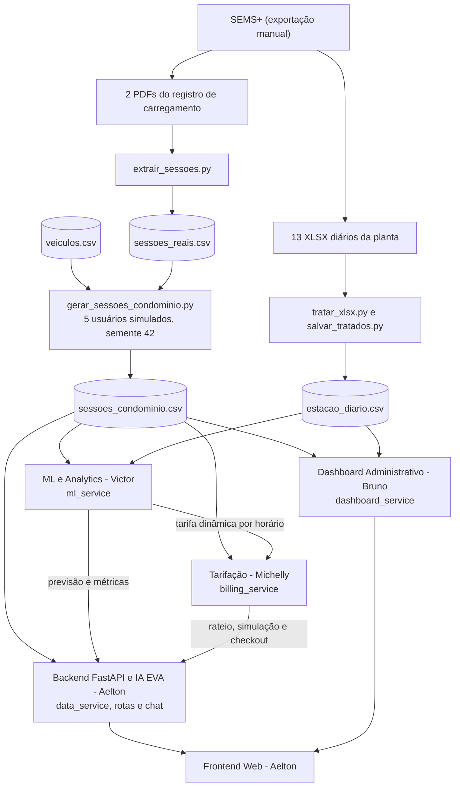

# Decisões Técnicas e Arquitetura - Sprint 02
## Projeto EV ChargeOps | GoodWe + FIAP
 
> Última atualização: 09/10/2026.
> Este documento registra as decisões técnicas da Sprint 02, os desvios em relação ao plano da Sprint 01 e o que foi ou não implementado. Itens marcados como **implementado** estão no repositório. Itens marcados como **não implementado** ficaram fora do protótipo, com a justificativa ao lado.
 
---
 
## 1. Justificativa de Desvios e Adaptações de Escopo (Sprint 01 → Sprint 02)
 
Para viabilizar a entrega de um protótipo funcional, robusto e com código autoral no prazo da Sprint 02, foram estabelecidas as seguintes decisões técnicas e operacionais em relação ao planejamento inicial da Sprint 01:
 
### 1.1. Infraestrutura, dados e interface
 
| Decisão / Desvio | Motivação & Limitação Técnica | Solução Adotada no Protótipo |
| :--- | :--- | :--- |
| **Backend autoral em Python/FastAPI, sem plataformas low-code** | Ferramentas low-code/no-code (como n8n) ocultam o código-fonte em workflows proprietários, geram dependência de serviços externos no momento da avaliação e enfraquecem a comprovação de autoria e domínio técnico exigidos na rubrica da FIAP. A Sprint 01 já previa FastAPI, e a decisão foi mantida. | **Backend em Python (FastAPI)**. A API centraliza as regras de negócio, expõe documentação interativa Swagger (`/docs`), integra os modelos de ML ao motor de rateio e conecta a IA conversacional aos dados de recarga. |
| **Ingestão por exportação manual do SEMS+ em vez da API** | Conforme a apresentação da GoodWe, não há suporte de API para os EV Chargers (a consulta é do tipo pull, sem tempo real), e o que foi liberado é o acesso à planta de monitoramento no SEMS+. | Exportações feitas pelo SEMS+: 13 relatórios mensais em **XLSX** (set/2025 a set/2026) e 2 **PDFs** com o registro de carregamento. Tudo é tratado por scripts Python em `backend/scripts/data_scripts`. |
| **Dados da estação em formato diário e agregado** | Os XLSX são o relatório diário da planta inteira. Eles não trazem sessão, usuário, veículo nem horário de uso. | `estacao_diario.csv` (395 dias x 13 indicadores) é usado como série de contexto. As sessões vêm do registro de carregamento do SEMS+. |
| **Usuários e veículos simulados sobre sessões reais** | As sessões reais vêm de um único carregador e de um único cartão RFID. Não há dados de vários moradores nem do modelo do carro. | `gerar_sessoes_condominio.py` atribui cada sessão real a um de 5 usuários simulados, com 3 modelos do catálogo (Mercedes-Benz EQE 350+, BYD Seal e Volvo EX30), por sorteio com semente fixa (42). Horários, kWh e durações são reais. Usuário e veículo são simulados. |
| **Persistência em CSV (tabelas) e JSON (metadados) no lugar do PostgreSQL** | A Sprint 01 previa PostgreSQL com as entidades Usuário, Unidade, Sessão e Fatura. Para o protótipo, o volume é pequeno (242 sessões, 5 usuários) e os dados são somente leitura, então um SGBD acrescentaria instalação e configuração sem ganho na demonstração. | `estacao_diario.csv`, `sessoes_reais.csv`, `sessoes_condominio.csv` e `veiculos.csv` em `backend/data`. O JSON fica para os metadados do condomínio (`ev_chargeops_data.json`, com valores padrão no `data_service` quando o arquivo não existe). Sem banco, não há cadastro, edição nem entidade Fatura persistida. |
| **Tarifa como parâmetro do sistema** | Os valores em R$ dos XLSX usam uma tarifa fixa de R$ 1,00 por kWh (confirmado nos 395 dias, na importação e na exportação). Eles não representam uma tarifa real. | `DEFAULT_RATE_PER_KWH` em `config.py` (R$ 0,95, configurável por `.env`), usada como tarifa base da precificação dinâmica. |
| **Potência e tempo de recarga calibrados com dados reais** (implementado) | O carregador de referência é de 7 kW, mas nas sessões reais a potência média foi de cerca de 2,1 kW e o pico de 3,4 a 3,5 kW. Usar a potência nominal subestima o tempo de recarga em cerca de 3 vezes. | O simulador (`billing_service.simulate_charge`) usa a relação calibrada nas 242 sessões reais: tempo (h) = 0,94 + 0,366 x kWh (R² 0,86, erro médio de 22 minutos), com a potência nominal como piso físico. O frontend usa a mesma relação no modo offline. |
| **Descontinuação da conexão direta aos carregadores** | Restrições logísticas de rede local e segurança no Energy Innovation Lab da FIAP (Estacionamento L1). | O controle e a simulação das sessões de recarga operam sobre o fluxo de dados coletados, desacoplados do acionamento físico imediato. |
| **Substituição de RFID / Bluetooth** | Limitações de disponibilidade de hardware dedicado (leitores e tags) e complexidade de integração embarcada na fase atual. O carregador real aceita RFID, e o registro traz o ID do cartão. | A identificação do usuário e a autorização de recarga são realizadas diretamente via interface da aplicação e simulação lógica de sessão. |
| **Frontend em HTML, CSS e JavaScript no lugar de React e React Native** | A Sprint 01 previa React (dashboard do gestor) e React Native (app do morador). Um frontend sem build e servido pelo próprio FastAPI permite rodar tudo em um único processo, sem Node.js, o que simplifica a execução na avaliação. | Aplicação web responsiva em `frontend/`, com as abas do morador (EVA, simulador e histórico) e do gestor (dashboard) na mesma página. Não há app mobile nativo. |
| **Pagamento simulado no lugar de gateway (Stripe ou PIX)** | Integração com meio de pagamento real exige conta, credenciais e ambiente de homologação, fora do escopo do protótipo. | `POST /api/billing/checkout` gera um comprovante simulado (identificador, unidade, energia, tarifa do horário e valor). O botão "Simular Autorização & Rateio" do simulador chama essa rota. |
| **Login, notificações e acessibilidade não implementados** | Dependem de banco de dados e cadastro (login), de um canal de envio (notificações) e de tempo de desenvolvimento que foi priorizado para rateio e IA. | Não implementados. Ficam como evolução. |
 
### 1.2. Módulo de Inteligência Artificial
 
A Sprint 01 definiu duas IAs: a **IA de Controle Operacional** (previsão de consumo por regressão, estimativa de tempo restante e detecção de anomalias) e a **IA EVA** (RAG sobre uma base de conhecimento fechada). O que foi implementado e o que mudou:
 
| Plano da Sprint 01 | O que foi implementado | Justificativa |
| :--- | :--- | :--- |
| **Previsão de consumo por modelo de regressão (scikit-learn)** | Previsão de demanda diária por **mediana de kWh por dia da semana** (`ml_service.predict_demand`), validada por data e comparada com linhas de base em `02_modelo_demanda.ipynb` (MAE de 4,15 kWh por dia, melhor de seis variantes). | As sessões trazem apenas data, hora, duração e kWh, de um único cartão RFID. Sem outras variáveis explicativas (clima, ocupação, perfil real de cada morador), o único sinal disponível é o calendário. A demanda é intermitente (30% a 41% dos dias de semana sem recarga), e nesse cenário a mediana por dia da semana teve o menor erro na validação por data. Por isso o grupo optou por um modelo simples e explicável, em vez de uma regressão sem atributos que a sustentem. |
| **Previsão da fatura mensal de cada usuário** | Não implementada. A previsão é do total diário da estação. | Os usuários são simulados por sorteio sobre as sessões de um único cartão, então o histórico "por usuário" não tem padrão próprio para ser aprendido. Uma previsão individual reproduziria o sorteio, e não o comportamento de um morador. |
| **IA alimentando o motor de rateio** | **Implementado.** A **precificação dinâmica** (`ml_service.get_dynamic_pricing`) aprende a janela de pico com o horário de início das sessões reais (20:00 às 21:59, 56,8% da energia) e calcula as tarifas de pico (R$ 1,14) e fora do pico (R$ 0,70), neutras em receita. O `billing_service.calculate_tarifa_atual` usa essa tabela em `/calculate`, `/simulate` e `/checkout`. | É a forma pela qual a IA tem papel estrutural no fluxo: a saída do modelo define o valor por kWh que entra na fórmula `Fatura = kWh x Tarifa`. |
| **Estimativa do tempo restante de carga** | Implementada como **relação calibrada** nas sessões reais (tempo = 0,94 + 0,366 x kWh), usada no simulador. | Não há telemetria em tempo real (ver seção 1.1), então a estimativa é feita antes da sessão, a partir da energia desejada, e não durante a sessão. |
| **Detecção de anomalias** | **Não implementada.** A qualidade dos dados é tratada por regras fixas na extração: sessões abaixo de 0,5 kWh e as 6 sessões sem cartão de setembro/2025 (cerca de 5,5 kW, uma de 41,62 kWh) ficam fora do conjunto do condomínio. | A exportação do SEMS+ não traz eventos de erro, interrupção ou falha do equipamento, que seriam o alvo principal da detecção. Com um único carro e sem casos de anomalia confirmados para validar o modelo, não seria possível medir se um detector acerta. Fica como evolução quando houver telemetria por sessão. |
| **EVA com RAG (LangChain) sobre manual do HCA G2, regulamento interno e documentação do rateio** | **Injeção de contexto** (*context injection*): o prompt recebe o perfil do morador, o veículo, a tarifa, a fórmula do rateio e o histórico de sessões (`ai_eva_service._build_system_prompt`), com modelo OpenAI (`gpt-4o-mini`). Sem chave da OpenAI, um motor de regras responde às perguntas principais. | O regulamento interno do condomínio não existe (o condomínio é simulado), e o conteúdo necessário cabe inteiro no prompt, então não há o que recuperar por busca vetorial. A injeção de contexto entrega o mesmo objetivo do RAG (resposta restrita aos dados da plataforma) sem a dependência do LangChain e de um banco vetorial. O motor de regras garante que a demonstração funcione sem internet ou sem chave. |
 
---
 
## 2. Especificação dos Módulos da Solução
 
### 2.1. Backend & Inteligência Artificial Conversacional (IA EVA)
* **Responsável:** Aelton  
* **Tecnologias:** Python 3, FastAPI, Uvicorn, OpenAI API (GPT-4o-mini), Pydantic.  
* **Fontes de Dados:** `sessoes_condominio.csv` (lido pelo `data_service`) e metadados do condomínio em JSON.  
* **Implementado:**
  - API REST central do projeto com rotas documentadas (`/docs` - Swagger UI), servindo também o frontend.
  - Leitura e sanitização das sessões tratadas no `data_service` (o tratamento dos arquivos brutos fica nos scripts do módulo de ML, seção 2.2).
  - **IA EVA** via injeção dinâmica de contexto (ver seção 1.2), com suporte às consultas:
    1. *"Quantas horas o carro aguenta com a bateria atual?"*
    2. *"Quantos kWh faltam para completar a carga?"*
    3. *"Qual será o custo estimado da recarga?"*
    4. *"Como funciona o modelo de rateio por kWh?"*
    5. *"Qual o melhor horário para carregar?"*
    6. *"Por que minha fatura subiu este mês?"*
  - Endpoints dedicados para o frontend e integração com as saídas de Machine Learning e Tarifação.
  - Integração da EVA com os outros módulos: as estimativas de tempo e custo usam o simulador do `billing_service`, as respostas sobre horário usam a precificação dinâmica do `ml_service`, e o prompt do Modo Conectado recebe também o consumo mensal do morador e a previsão de demanda. Consultas adicionais: *"Qual o melhor horário para carregar?"* e *"Por que minha fatura subiu este mês?"*.
---
 
### 2.2. Machine Learning & Analytics - Predição e Consumo
* **Responsável:** Victor Mantovani  
* **Entregáveis:** Modelos preditivos e rotinas analíticas integradas ao backend (`ml_service`) e expostas em `/api/analytics`.  
* **Fontes de dados:** `sessoes_condominio.csv` (sessões), `estacao_diario.csv` (contexto da planta) e `veiculos.csv` (catálogo de veículos).  
* **Implementado:**
  - Pipeline de tratamento dos XLSX da estação (`tratar_xlsx.py`, `salvar_tratados.py`) e extração das sessões reais dos PDFs (`extrair_sessoes.py`).
  - Catálogo de veículos com bateria, autonomia no ciclo Inmetro e consumo oficial do PBE Veicular.
  - Geração das sessões do condomínio (`gerar_sessoes_condominio.py`) e alinhamento do `data_service` e dos perfis de usuário aos três modelos do catálogo.
  - Remoção da leitura de `energia_carregada_kwh` como se fosse sessão de recarga no `data_service` (essa coluna não é energia de carro).
  - Conversão paramétrica **Tempo $\leftrightarrow$ kWh $\leftrightarrow$ Custo**, calibrada com as sessões reais e com a autonomia de cada veículo (capacidade total ÷ autonomia Inmetro).
  - Análise histórica e temporal do consumo por hora, dia da semana e mês (`01_analise_temporal.ipynb`).
  - Modelo de previsão de demanda com validação por data e comparação com linhas de base (`02_modelo_demanda.ipynb` e `predict_demand`).
  - Precificação dinâmica por horário de início da sessão, calculada a partir da janela de pico das sessões reais e neutra em receita (`get_dynamic_pricing`), consumida pelo motor de rateio.
  - Rotas `/api/analytics/summary`, `/api/analytics/demand-prediction` e `/api/analytics/dynamic-pricing`.
* **Não implementado:** detecção de anomalias e previsão da fatura por usuário (justificativas na seção 1.2).
---
 
### 2.3. Sistema de Tarifação e Simulação de Pagamentos
* **Responsável:** Michelly  
* **Implementado:**
  - Fórmula oficial do rateio, `Fatura = kWh x Tarifa`, com a tarifa do horário vinda da precificação dinâmica (`calculate_tarifa_atual` e `calculate_rateio`).
  - Simulação da recarga a partir da capacidade da bateria e do nível atual e desejado de carga, com energia, tempo, custo e autonomia adicionada (`simulate_charge`).
  - Exibição transparente do custo, com a decomposição da tarifa em energia efetiva (R$ 0,82 de R$ 0,95, cerca de 86%) e quota de manutenção do carregador (R$ 0,13, cerca de 14%), aplicada proporcionalmente à tarifa do horário.
  - Simulação de checkout com comprovante (`process_checkout_simulation`), chamada pelo botão de autorização do simulador. A rota valida a energia (maior que zero) e a hora de início (0 a 23).
* **Não implementado:**
  - Escolha direta por tempo de carregamento ou por volume de kWh: o simulador parte do nível de carga (%) e calcula energia e tempo.
---
 
### 2.4. Interface do Usuário (Frontend Web)
* **Responsável:** Aelton  
* **Tecnologias:** Aplicação Web responsiva (HTML5, CSS3, JavaScript), servida pelo FastAPI.  
* **Implementado:**
  - Aplicação web centralizadora com as abas IA EVA, Simulador de Recarga & Rateio, Telemetria & Histórico e Dashboard Administrativo.
  - Integração com a API para o chat da EVA, o histórico de sessões, a simulação (com tarifa do horário) e o checkout.
---
 
### 2.5. Dashboard Administrativo, Gestão e Documentação
* **Responsável:** Bruno  
* **Implementado:**
  - Dashboard gerencial alimentado pela base tratada da GoodWe, com:
    1. Consumo energético total e por sessão;
    2. Nível da bateria (estimado pela energia entregue ÷ capacidade, pois o carregador não informa o SoC);
    3. Tempo médio de permanência e carga;
    4. Faturamento total e por usuário;
    5. Indicadores de eficiência energética da planta.
  - Painel de consulta de usuários, veículos, carregadores e histórico de pagamentos.
  - Consolidação e manutenção do `README.md` e artefatos de entrega da sprint.
* **Não implementado:** taxa de inadimplência (não há dados de pagamento) e gestão de credenciais (não há login nem banco de dados).
---
 
## 3. Fluxo de Dados e Integração dos Módulos
 

 
---
 
## 4. Matriz de Responsabilidades e Janelas de Execução
 
| Módulo / Frente | Responsável | Escopo Principal | Janela Prevista |
| :--- | :--- | :--- | :---: |
| **Backend REST & IA EVA** | Aelton | Desenvolvimento da API FastAPI, integração OpenAI, injeção de contexto e sanitização de dados | 28 – 01 |
| **IA & Analytics** | Victor Mantovani | Modelos de consumo, predição de demanda e conversão energética | 28 – 01 |
| **Sistema de Pagamento** | Michelly | Regras de rateio, simulação de checkout e métodos de cálculo | 28 – 05 |
| **Dashboard e Gestão** | Bruno | Painel de controle em CSV/JSON, gestão operacional e documentação | 05 – 10 |
| **Frontend Web** | Aelton | Interface web integrando chat com IA EVA, simulação e visualização | 28 – 08 |
 
As janelas acima são as do planejamento original.
 
---
 
## 5. Diferenciais Competitivos da Solução
 
- **IA EVA Contextualizada e Nativa:** Assistente virtual integrado diretamente à API e alimentado pelos dados de recarga, veículos e faturamento, respondendo em linguagem natural.
- **Backend Robusto e Documentado:** API REST desenvolvida em FastAPI com documentação Swagger automática (`/docs`), facilitando validação, testes e extensibilidade.
- **Previsão de demanda e tarifa de incentivo:** previsão do consumo diário e tarifa mais barata fora da janela de pico, para estimular a recarga em horários de menor demanda no condomínio.
- **Rateio Justo e Transparente:** Faturamento baseado no consumo real medido (kWh), superando a divisão genérica na taxa condominial.
- **Painel Administrativo Unificado:** Visão ponta a ponta para síndicos e administradoras acompanharem métricas energéticas e faturamento.
- **Base ancorada em dados reais:** 13 meses de dados da planta e 242 sessões reais de recarga do carregador GoodWe. Usuários e veículos são simulados e identificados como tal.
---
 
## 6. Dados Utilizados e Limitações Conhecidas
 
### 6.1. Arquivos de dados
 
| Arquivo | Origem | Conteúdo | Natureza |
| :--- | :--- | :--- | :--- |
| `data/brutos/Station Statistical Report(...).xlsx` (13 arquivos) | Exportação do SEMS+ | Relatório diário da planta, 13 indicadores, set/2025 a set/2026 | Real |
| `data/brutos/Registo de carregamento ... .pdf` (2 arquivos) | Exportação do SEMS+ | Registro das sessões de recarga (início, fim, duração, kWh) | Real |
| `data/tratados/estacao_diario.csv` | `tratar_xlsx.py` e `salvar_tratados.py` | 395 dias x 13 colunas, uma linha por dia | Real, tratado |
| `data/tratados/sessoes_reais.csv` | `extrair_sessoes.py` | 266 sessões, 247 válidas (pelo menos 0,5 kWh), 1.960,91 kWh | Real, tratado |
| `data/referencia/veiculos.csv` | PBE Veicular/Inmetro e divulgações dos fabricantes | 3 modelos: bateria total, autonomia Inmetro e consumo oficial (MJ/km) | Criado pelo grupo a partir de fontes públicas |
| `data/tratados/sessoes_condominio.csv` | `gerar_sessoes_condominio.py` | 242 sessões no formato do `SessionItem`, com usuário e veículo atribuídos | Horários, kWh e durações reais. Usuário e veículo simulados |
 
### 6.2. Limitações dos dados da estação (XLSX)
 
- Os valores em R$ usam tarifa fixa de R$ 1,00 por kWh. Não são uma tarifa real.
- A coluna `energia_carregada_kwh` (total de 387,2 kWh no período, máximo de 9,1 kWh por dia) **não é a recarga dos carros**: as sessões somam 1.960,9 kWh. A planta informa 0 kWh de armazenamento, e o que essa coluna mede segue sem explicação. Ela não é usada na lógica de recarga nem nos modelos.
- A relação consumo = importação + autoconsumo só fecha em cerca de 59% dos dias (160 de 395 não fecham). A diferença típica é pequena (0,3 a 0,4 kWh), com poucos dias de diferença negativa grande (mínimo de -6,2 kWh).
- Em setembro/2025, a geração foi de 0,4 kWh e a exportação de 241 kWh, uma inconsistência não explicada.
- Os dados são diários e da planta inteira. Não permitem análise por horário.
### 6.3. Limitações dos dados de sessão (SEMS+)
 
- Todas as sessões usadas vêm de um único cartão RFID e de um único carregador. A demanda de um condomínio com vários moradores é simulada a partir desse padrão.
- Seis sessões do início de setembro/2025 não têm cartão e têm potência bem maior (cerca de 5,5 kW, com uma sessão de 41,62 kWh). Parecem testes ou outro veículo e ficaram fora do conjunto do condomínio.
- O "quilômetro" mostrado no aplicativo é sempre 5 km por kWh (fator fixo do app). Não é uma medição do carro.
- Os campos "energia verde" e "energia importada" do aplicativo não parecem medição confiável (quase 100% verde e 0 importada, mesmo à noite) e não são usados.
- A potência máxima observada é de 3,4 a 3,5 kW, o que equivale a 16 A em 220 V. Não foi confirmado se o limite vem do carro ou da configuração do carregador.
### 6.4. Padrões observados nas sessões reais
 
Base: as 242 sessões de `sessoes_condominio.csv`, a mesma usada pelo backend e pelo README.
 
- 88% das sessões começam entre 17h e 23h, e 57% às 20h ou 21h.
- Energia média de 7,8 kWh por sessão e duração média de 3,8 horas.
- A demanda varia por dia da semana (média de kWh por dia: sábado cerca de 1,9 e domingo cerca de 6,8).
### 6.5. Catálogo de veículos
 
- O consumo oficial do Inmetro (MJ/km) e a conta capacidade ÷ autonomia não coincidem. A segunda dá um consumo de 26% a 41% maior. O simulador adota a convenção capacidade total ÷ autonomia Inmetro (sem a autonomia do veículo, usa 4,6 km/kWh, média dos 3 modelos).
- A potência de carga em corrente alternada dos carros não foi incluída, porque o carregador de referência (7 kW) limita a recarga.
### 6.6. Tarifa histórica e tarifa dinâmica
 
- As 242 sessões históricas e o faturamento do dashboard (R$ 1.788,84) estão calculados com a tarifa base de R$ 0,95 por kWh.
- A tarifa dinâmica (R$ 1,14 no pico e R$ 0,70 fora dele) vale para cálculos novos: `/api/billing/calculate`, `/simulate` e `/checkout`. Com o mesmo padrão de horário, as duas tarifas dão a mesma receita total.
---
 
## 7. Pontos de Alinhamento entre os Módulos
 
**Backend e IA EVA (Aelton)**
- O `data_service` lê `sessoes_condominio.csv` (caminho `SESSIONS_CSV_PATH` em `config.py`). O caminho `STATION_CSV_PATH` aponta para o arquivo da estação.
- Os cinco perfis de usuário mantêm IDs, nomes e unidades e usam os três modelos do catálogo.
- O contexto da EVA e as respostas sobre sessões se baseiam em sessões reais com usuários simulados.
**Tarifação (Michelly)**
- A tarifa base é R$ 0,95 por kWh. A decomposição 0,82 + 0,13 é aplicada de forma proporcional à tarifa do horário.
- O simulador usa o tempo calibrado nas sessões reais e a autonomia de cada veículo.
**Dashboard e documentação (Bruno)**
- O README registra os desvios e as limitações das seções 1 e 6.
- O dashboard não exibe `energia_carregada_kwh` como recarga de veículos.
---
 
## 8. Pendências Abertas
 
- Confirmar no SEMS+ o modelo do carregador do laboratório (a apresentação da GoodWe indica o GW7K-HCA-20, de 7 kW) e a corrente configurada. O código usa 7 kW no simulador, na EVA e nos metadados do carregador.
- Definir a tarifa final do condomínio (hoje R$ 0,95/kWh).
- Esclarecer o que a coluna `energia_carregada_kwh` mede (baixa prioridade).
- Verificar se o consumo diário da planta inclui a energia do carregador.
