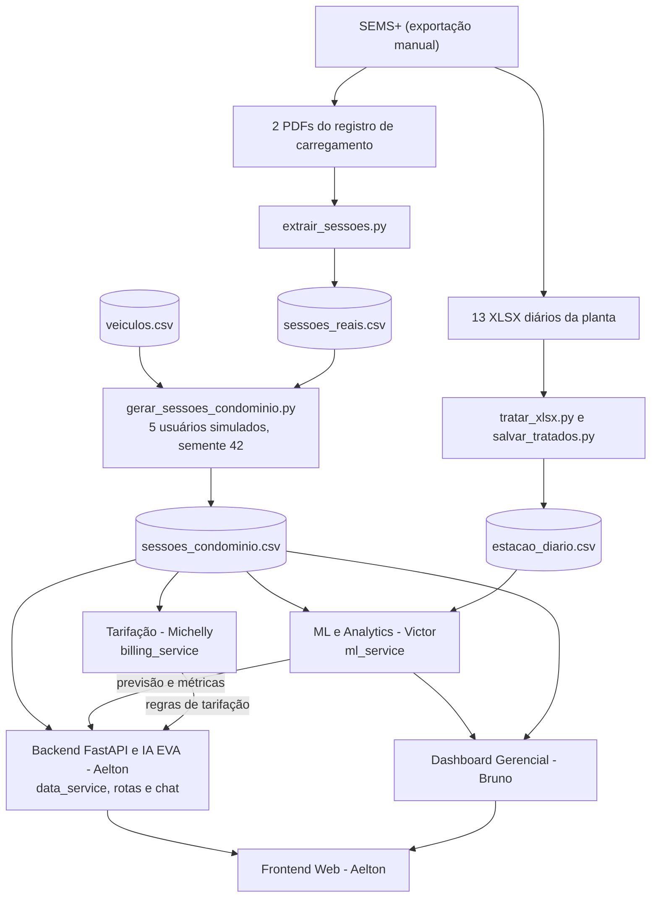

# Decisões Técnicas e Arquitetura - Sprint 02
## Projeto EV ChargeOps | GoodWe + FIAP
 
> Última atualização: 02/10/2026.
> Este documento reflete o que já foi implementado nos dados e no módulo de ML e o que ainda será feito. Itens marcados como **implementado** já estão no repositório. Itens marcados como **planejado** ou **em andamento** ainda não estão concluídos.
 
---
 
## 1. Justificativa de Desvios e Adaptações de Escopo (Sprint 01 → Sprint 02)
 
Para viabilizar a entrega de um protótipo funcional, robusto e com código autoral no prazo da Sprint 02, foram estabelecidas as seguintes decisões técnicas e operacionais em relação ao planejamento inicial da Sprint 01:
 
| Decisão / Desvio | Motivação & Limitação Técnica | Solução Adotada no Protótipo |
| :--- | :--- | :--- |
| **Backend em Python/FastAPI (Substituição do n8n)** | Plataformas low-code/no-code (como n8n) ocultam o código-fonte em workflows proprietários, geram dependência de serviços externos no momento da avaliação e enfraquecem a comprovação de autoria e domínio técnico exigidos na rubrica da FIAP. | Desenvolvimento de um **Backend autoral em Python (FastAPI)**. A API centraliza as regras de negócio, expõe documentação interativa Swagger (`/docs`), integra nativamente os modelos de ML e conecta a IA conversacional aos dados reais de recarga. |
| **Ingestão por exportação manual do SEMS+ em vez da API** | Conforme a apresentação da GoodWe, não há suporte de API para os EV Chargers (a consulta é do tipo pull, sem tempo real), e o que será liberado é o acesso à planta de monitoramento no SEMS+. | Exportações feitas pelo SEMS+: 13 relatórios mensais em **XLSX** (set/2025 a set/2026) e 2 **PDFs** com o registro de carregamento. Tudo é tratado por scripts Python em `backend/scripts/data_scripts`. |
| **Dados da estação em formato diário e agregado** | Os XLSX são o relatório diário da planta inteira. Eles não trazem sessão, usuário, veículo nem horário de uso. | `estacao_diario.csv` (395 dias x 13 indicadores) é usado como série de contexto. As sessões vêm do registro de carregamento do SEMS+. |
| **Usuários e veículos simulados sobre sessões reais** | As sessões reais vêm de um único carregador e de um único cartão RFID. Não há dados de vários moradores nem do modelo do carro. | `gerar_sessoes_condominio.py` atribui cada sessão real a um de 5 usuários simulados, com 3 modelos do catálogo (Mercedes-Benz EQE 350+, BYD Seal e Volvo EX30), por sorteio com semente fixa (42). Horários, kWh e durações são reais. Usuário e veículo são simulados. |
| **Persistência em CSV (tabelas) e JSON (metadados)** | Prototipação rápida com pandas, e dados tabulares são mais simples em CSV, sem necessidade de SGBD. | `estacao_diario.csv`, `sessoes_reais.csv`, `sessoes_condominio.csv` e `veiculos.csv` em `backend/data`. O JSON fica para os metadados do condomínio (`ev_chargeops_data.json`, com valores padrão no `data_service` quando o arquivo não existe). |
| **Tarifa como parâmetro do sistema** | Os valores em R$ dos XLSX usam uma tarifa fixa de R$ 1,00 por kWh (confirmado nos 395 dias, na importação e na exportação). Eles não representam uma tarifa real. | `DEFAULT_RATE_PER_KWH` em `config.py` (R$ 0,95, configurável por `.env`). O valor final deve ser definido com a responsável pela tarifação. |
| **Potência e tempo de recarga calibrados com dados reais** | O carregador de referência é de 7 kW, mas nas sessões reais a potência média foi de cerca de 2,1 kW e o pico de 3,4 a 3,5 kW. Usar a potência nominal subestima o tempo de recarga em cerca de 3 vezes. | **Planejado:** o simulador usará uma relação calibrada nas sessões reais (tempo em horas ≈ 0,94 + 0,366 x kWh, com erro médio de 22 minutos), válida para o carro e a configuração observados. |
| **Descontinuação da conexão direta aos carregadores** | Restrições logísticas de rede local e segurança no Energy Innovation Lab da FIAP (Estacionamento L1). | O controle e a simulação das sessões de recarga operam sobre o fluxo de dados coletados, desacoplados do acionamento físico imediato. |
| **Substituição de RFID / Bluetooth** | Limitações de disponibilidade de hardware dedicado (leitores e tags) e complexidade de integração embarcada na fase atual. O carregador real aceita RFID, e o registro traz o ID do cartão. | A identificação do usuário e a autorização de recarga são realizadas diretamente via interface da aplicação e simulação lógica de sessão. |
 
---
 
## 2. Especificação dos Módulos da Solução
 
### 2.1. Backend & Inteligência Artificial Conversacional (IA EVA)
* **Responsável:** Aelton  
* **Tecnologias:** Python 3, FastAPI, Uvicorn, OpenAI API (modelos GPT-4o / GPT-4o-mini), Pydantic.  
* **Fontes de Dados:** Arquivo CSV tratado da GoodWe e dados das sessões estruturados em JSON.  
* **Responsabilidades:**
  - Construção da API REST central do projeto com rotas documentadas (`/docs` - Swagger UI).
  - Pipeline de validação, limpeza e normalização dos dados brutos exportados do carregador GoodWe.
  - Implementação da **IA EVA** (assistente inteligente da plataforma) via injeção dinâmica de contexto (*context injection / RAG em memória*):
    - Conecta a IA diretamente aos dados de consumo, status da bateria e regras de rateio.
    - Suporte a consultas em linguagem natural pelos moradores/usuários:
      1. *“Quantas horas o carro aguenta com a bateria atual?”*
      2. *“Quantos kWh faltam para completar a carga?”*
      3. *“Qual será o custo estimado da recarga?”*
  - Endpoints dedicados para consumo do Frontend e integração com as saídas de Machine Learning e Tarifação.
---
 
### 2.2. Machine Learning & Analytics - Predição e Consumo
* **Responsável:** Victor Mantovani  
* **Entregáveis:** Modelos preditivos e rotinas analíticas integradas ao backend (`ml_service`) e expostas em `/api/analytics`.  
* **Fontes de dados:** `sessoes_condominio.csv` (sessões), `estacao_diario.csv` (contexto da planta) e `veiculos.csv` (catálogo de veículos).  
* **Implementado:**
  - Pipeline de tratamento dos XLSX da estação (`tratar_xlsx.py`, `salvar_tratados.py`) e extração das sessões reais dos PDFs (`extrair_sessoes.py`).
  - Catálogo de veículos com bateria, autonomia no ciclo Inmetro e consumo oficial do PBE Veicular.
  - Geração das sessões do condomínio (`gerar_sessoes_condominio.py`) e alinhamento do `data_service` e dos perfis de usuário aos três modelos do catálogo.
* **Em andamento:**
  - Remoção da leitura de `energia_carregada_kwh` como se fosse sessão de recarga no `data_service` (essa coluna não é energia de carro).
* **Planejado:**
  - Conversão automatizada e paramétrica: **Tempo $\leftrightarrow$ kWh $\leftrightarrow$ Custo**, calibrada com as sessões reais e com os dados do veículo (hoje o simulador usa 7,4 kW e 6,8 km/kWh fixos).
  - Análise histórica e temporal do consumo (perfil por hora, dia da semana e mês).
  - Modelo de predição de uso e demanda para mitigar picos no condomínio, com validação por data e comparação com uma linha de base.
  - Lógica para precificação dinâmica e inteligente, a partir da previsão.
  - Exportação e integração: substituir `predict_demand` e `get_station_summary`, mantendo o formato de resposta das rotas `/api/analytics/summary` e `/api/analytics/demand-prediction`.
---
 
### 2.3. Sistema de Tarifação e Simulação de Pagamentos
* **Responsável:** Michelly  
* **Responsabilidades:**
  - Interface e regras de negócio para parametrização da recarga pelo condômino:
    1. Escolha por tempo de carregamento;
    2. Escolha por volume de energia desejado (kWh);
    3. Exibição automática e transparente do cálculo de custo de rateio;
    4. Simulação de checkout e confirmação de pagamento digital no aplicativo.
  - Formulação de metodologias de custo (energia efetiva vs. durabilidade e proteção da bateria).
  - Integração dos valores simulados com os endpoints da API e a IA EVA.
---
 
### 2.4. Interface do Usuário (Frontend Web)
* **Responsável:** Aelton  
* **Tecnologias:** Aplicação Web responsiva (HTML5, CSS3, JavaScript modular).  
* **Responsabilidades:**
  - Desenvolvimento da aplicação web centralizadora do sistema.
  - Integração com a API FastAPI para consumo do chat com a IA EVA, painel de histórico de sessões e simulação de pagamento.
  - Design acessível, intuitivo e com foco na experiência do condômino.
---
 
### 2.5. Dashboard Administrativo, Gestão e Documentação
* **Responsável:** Bruno  
* **Responsabilidades:**
  - Desenvolvimento de dashboard gerencial alimentado pela base de dados tratada da GoodWe.
  - Painel com métricas operacionais essenciais:
    1. Consumo energético total e por sessão;
    2. Nível e status da bateria;
    3. Tempo médio de permanência e carga;
    4. Faturamento total e taxa de inadimplência/rateio;
    5. Indicadores de eficiência energética do ponto de recarga.
  - Painel administrativo para gestão de usuários, credenciais, veículos e histórico de pagamentos.
  - Consolidação e manutenção do `README.md` e artefatos de entrega da sprint.
---
 
## 3. Fluxo de Dados e Integração dos Módulos
 

 
---
 
## 4. Matriz de Responsabilidades e Janelas de Execução
 
| Módulo / Frente | Responsável | Escopo Principal | Janela Prevista |
| :--- | :--- | :--- | :---: |
| **Backend REST & IA EVA** | Aelton | Desenvolvimento da API FastAPI, integração OpenAI, injeção de contexto e sanitização de dados | 28 – 01 |
| **IA & Analytics** | Victor Mantovani | Modelos de consumo, predição de demanda e conversão energética | 28 – 01 |
| **Sistema de Pagamento** | Michelly | Regras de rateio, simulação de checkout e métodos de cálculo | 28 – 05 |
| **Dashboard e Gestão** | Bruno | Painel de controle em CSV/JSON, gestão operacional e documentação | 05 – 10 |
| **Frontend Web** | Aelton | Interface web integrando chat com IA EVA, simulação e visualização | 28 – 08 |
 
As janelas acima são as do planejamento original e devem ser reavaliadas com o grupo.
 
---
 
## 5. Diferenciais Competitivos da Solução
 
- **IA EVA Contextualizada e Nativa:** Assistente virtual inteligente integrado diretamente à API e alimentado pelos dados de recarga, veículos e faturamento, respondendo em linguagem natural.
- **Backend Robusto e Documentado:** API REST desenvolvida em FastAPI com documentação Swagger automática (`/docs`), facilitando validação, testes e extensibilidade.
- **Predição de Demanda com ML:** Algoritmos para balanceamento e prevenção de sobrecarga na rede elétrica interna do condomínio.
- **Rateio Justo e Transparente:** Faturamento baseado no consumo real medido (kWh), superando a divisão genérica na taxa condominial.
- **Painel Administrativo Unificado:** Visão ponta a ponta para síndicos e administradoras acompanharem métricas energéticas e faturamento.
- **Experiência Digital Fluida:** Jornada do morador moderna, comparável aos melhores aplicativos de mobilidade urbana e conveniência.
- **Base ancorada em dados reais:** 13 meses de dados da planta e 242 sessões reais de recarga do carregador GoodWe. Usuários e veículos são simulados e identificados como tal.
---
 
## 6. Dados Utilizados e Limitações Conhecidas
 
### 6.1. Arquivos de dados
 
| Arquivo | Origem | Conteúdo | Natureza |
| :--- | :--- | :--- | :--- |
| `data/brutos/Station Statistical Report(...).xlsx` (13 arquivos) | Exportação do SEMS+ | Relatório diário da planta, 13 indicadores, set/2025 a set/2026 | Real |
| `data/brutos/Registo de carregamento ... .pdf` (2 arquivos) | Exportação do SEMS+ | Registro das sessões de recarga (início, fim, duração, kWh) | Real |
| `data/tratados/estacao_diario.csv` | `tratar_xlsx.py` e `salvar_tratados.py` | 395 dias x 13 colunas, uma linha por dia | Real, tratado |
| `data/tratados/sessoes_reais.csv` | `extrair_sessoes.py` | 266 sessões, 247 válidas (pelo menos 0,5 kWh), 1.960,91 kWh | Real, tratado |
| `data/referencia/veiculos.csv` | PBE Veicular/Inmetro e divulgações dos fabricantes | 3 modelos: bateria total, autonomia Inmetro e consumo oficial (MJ/km) | Criado pelo grupo a partir de fontes públicas |
| `data/tratados/sessoes_condominio.csv` | `gerar_sessoes_condominio.py` | 242 sessões no formato do `SessionItem`, com usuário e veículo atribuídos | Horários, kWh e durações reais. Usuário e veículo simulados |
 
### 6.2. Limitações dos dados da estação (XLSX)
 
- Os valores em R$ usam tarifa fixa de R$ 1,00 por kWh. Não são uma tarifa real.
- A coluna `energia_carregada_kwh` (total de 387,2 kWh no período, máximo de 9,1 kWh por dia) **não é a recarga dos carros**: as sessões somam 1.960,9 kWh. A planta informa 0 kWh de armazenamento, e o que essa coluna mede segue sem explicação. Ela não é usada na lógica de recarga nem nos modelos.
- A relação consumo = importação + autoconsumo só fecha em cerca de 59% dos dias (160 de 395 não fecham). A diferença típica é pequena (0,3 a 0,4 kWh), com poucos dias de diferença negativa grande (mínimo de -6,2 kWh).
- Em setembro/2025, a geração foi de 0,4 kWh e a exportação de 241 kWh, uma inconsistência não explicada.
- Os dados são diários e da planta inteira. Não permitem análise por horário.
### 6.3. Limitações dos dados de sessão (SEMS+)
 
- Todas as sessões usadas vêm de um único cartão RFID e de um único carregador. A demanda de um condomínio com vários moradores é simulada a partir desse padrão.
- Seis sessões do início de setembro/2025 não têm cartão e têm potência bem maior (cerca de 5,5 kW, com uma sessão de 41,62 kWh). Parecem testes ou outro veículo e ficaram fora do conjunto do condomínio.
- O "quilômetro" mostrado no aplicativo é sempre 5 km por kWh (fator fixo do app). Não é uma medição do carro.
- Os campos "energia verde" e "energia importada" do aplicativo não parecem medição confiável (quase 100% verde e 0 importada, mesmo à noite) e não são usados.
- A potência máxima observada é de 3,4 a 3,5 kW, o que equivale a 16 A em 220 V. Não foi confirmado se o limite vem do carro ou da configuração do carregador.
### 6.4. Padrões observados nas sessões reais
 
- 87% das sessões começam entre 17h e 23h, e mais da metade às 20h ou 21h.
- Energia média de 7,9 kWh por sessão e duração média de 3,8 horas.
- A demanda varia por dia da semana (média de kWh por dia: sábado cerca de 1,9 e domingo cerca de 6,8).
### 6.5. Catálogo de veículos
 
- O consumo oficial do Inmetro (MJ/km) e a conta capacidade ÷ autonomia não coincidem. A segunda dá um consumo de 26% a 41% maior. A convenção a ser usada nas fórmulas ainda precisa ser decidida e documentada.
- A potência de carga em corrente alternada dos carros não foi incluída, porque o carregador de referência (7 kW) limita a recarga.
---
 
## 7. Pontos de Alinhamento entre os Módulos
 
**Backend e IA EVA (Aelton)**
- O `data_service` passou a ler `sessoes_condominio.csv` (caminho `SESSIONS_CSV_PATH` em `config.py`). O caminho `STATION_CSV_PATH` aponta para o arquivo da estação.
- Os cinco perfis de usuário mantêm IDs, nomes e unidades, e passaram a usar os três modelos do catálogo.
- O contexto da EVA e as respostas sobre sessões passam a se basear em sessões reais com usuários simulados.
**Tarifação (Michelly)**
- A tarifa padrão é R$ 0,95 por kWh, a confirmar. A decomposição 0,82 + 0,13 só fecha com o total quando a tarifa é 0,95.
- O simulador de carga usa 7,4 kW e 6,8 km/kWh fixos. Será calibrado com as sessões reais e com o consumo do veículo.
**Dashboard e documentação (Bruno)**
- O README deve registrar os desvios e as limitações das seções 1 e 6.
- O dashboard não deve exibir `energia_carregada_kwh` como recarga de veículos.
---
 
## 8. Pendências Abertas
 
- Confirmar no SEMS+ o modelo do carregador do laboratório (a apresentação da GoodWe indica o GW7K-HCA-20, de 7 kW) e a corrente configurada.
- Definir a tarifa final do condomínio.
- Decidir a convenção de consumo dos veículos.
- Esclarecer o que a coluna `energia_carregada_kwh` mede (baixa prioridade).
- Verificar se o consumo diário da planta inclui a energia do carregador.
- Confirmar o prazo real da Sprint 02 ("encerramento da Fase 6").
 