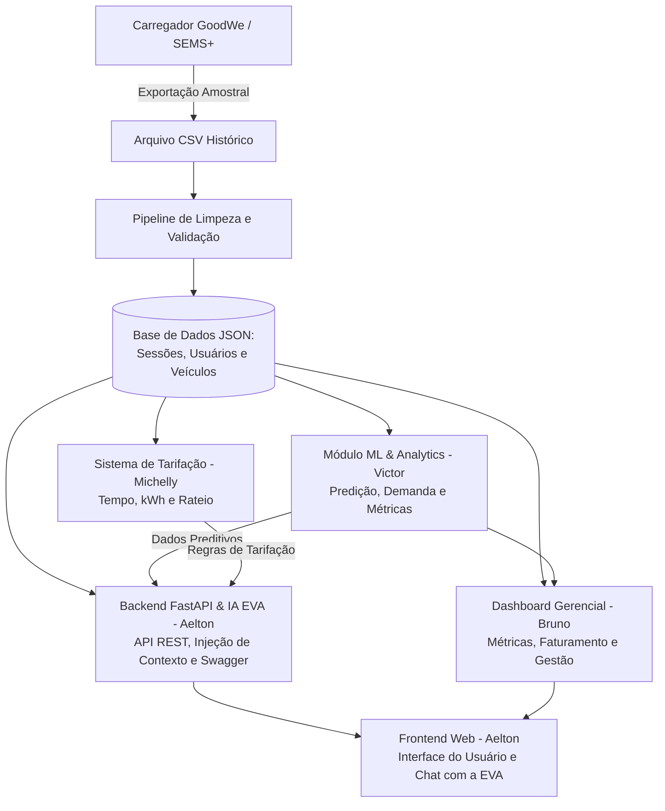

# Decisões Técnicas e Arquitetura - Sprint 02
## Projeto EV ChargeOps | GoodWe + FIAP

---

## 1. Justificativa de Desvios e Adaptações de Escopo (Sprint 01 → Sprint 02)

Para viabilizar a entrega de um protótipo funcional, robusto e com código autoral no prazo da Sprint 02, foram estabelecidas as seguintes decisões técnicas e operacionais em relação ao planejamento inicial da Sprint 01:

| Decisão / Desvio | Motivação & Limitação Técnica | Solução Adotada no Protótipo |
| :--- | :--- | :--- |
| **Backend em Python/FastAPI (Substituição do n8n)** | Plataformas low-code/no-code (como n8n) ocultam o código-fonte em workflows proprietários, geram dependência de serviços externos no momento da avaliação e enfraquecem a comprovação de autoria e domínio técnico exigidos na rubrica da FIAP. | Desenvolvimento de um **Backend autoral em Python (FastAPI)**. A API centraliza as regras de negócio, expõe documentação interativa Swagger (`/docs`), integra nativamente os modelos de ML e conecta a IA conversacional aos dados reais de recarga. |
| **Ingestão via CSV em vez da API SEMS+** | A liberação e o acesso direto à API oficial do SEMS+ (GoodWe) não foram disponibilizados em tempo hábil para o ciclo de desenvolvimento. | Exportação periódica de dados reais do carregador GoodWe em formato **CSV**, submetidos a um pipeline de limpeza, validação e estruturação de dados. |
| **Persistência desacoplada em JSON** | Simplificar a camada de infraestrutura de banco de dados na prototipação rápida, garantindo portabilidade entre os módulos sem necessidade de deploy de SGBD complexo. | Armazenamento de sessões de consumo, tempos de carga, usuários e veículos em estruturas estruturadas de arquivos **JSON**. |
| **Descontinuação da conexão direta aos carregadores** | Restrições logísticas de rede local e segurança no Energy Innovation Lab da FIAP (Estacionamento L1). | O controle e a simulação das sessões de recarga operam sobre o fluxo de dados coletados, desacoplados do acionamento físico imediato. |
| **Substituição de RFID / Bluetooth** | Limitações de disponibilidade de hardware dedicado (leitores e tags) e complexidade de integração embarcada na fase atual. | A identificação do usuário e a autorização de recarga são realizadas diretamente via interface da aplicação e simulação lógica de sessão. |

---

## 2. Especificação dos Módulos da Solução

### 2.1. Backend & Inteligência Artificial Conversacional (IA EVA)
* **Responsável:** Aelton  
* **Tecnologias:** Python 3, FastAPI, Uvicorn, OpenAI API (modelos GPT-4o / GPT-4o-mini), Pydantic.  
* **Fontes de Dados:** Arquivo CSV tratado da GoodWe e dados das sessões estruturados em JSON.  
* **Responsabilidades:**
  - Construção da API REST central do projeto com rotas documentadas (`/docs` - Swagger UI).
  - Pipeline de validação, limpeza e normalização dos dados brutos exportados do carregador GoodWe.
  - Implementação da **IA EVA** (assistente inteligente da plataforma) via injeção dinâmica de contexto (*context injection / RAG em memória*):
    - Conecta a IA diretamente aos dados de consumo, status da bateria e regras de rateio.
    - Suporte a consultas em linguagem natural pelos moradores/usuários:
      1. *“Quantas horas o carro aguenta com a bateria atual?”*
      2. *“Quantos kWh faltam para completar a carga?”*
      3. *“Qual será o custo estimado da recarga?”*
  - Endpoints dedicados para consumo do Frontend e integração com as saídas de Machine Learning e Tarifação.

---

### 2.2. Machine Learning & Analytics - Predição e Consumo
* **Responsável:** Victor Mantovani  
* **Entregáveis:** Modelos preditivos e rotinas analíticas integradas aos dados JSON.  
* **Responsabilidades:**
  - Análise histórica e temporal do consumo energético.
  - Modelo de predição de uso e demanda para mitigar picos no condomínio.
  - Lógica para precificação dinâmica e inteligente.
  - Conversão automatizada e paramétrica: **Tempo $\leftrightarrow$ kWh $\leftrightarrow$ Custo**.
  - Exportação e integração das saídas preditivas (ML) para consumo do Backend/IA e Dashboard.

---

### 2.3. Sistema de Tarifação e Simulação de Pagamentos
* **Responsável:** Michelly  
* **Responsabilidades:**
  - Interface e regras de negócio para parametrização da recarga pelo condômino:
    1. Escolha por tempo de carregamento;
    2. Escolha por volume de energia desejado (kWh);
    3. Exibição automática e transparente do cálculo de custo de rateio;
    4. Simulação de checkout e confirmação de pagamento digital no aplicativo.
  - Formulação de metodologias de custo (energia efetiva vs. durabilidade e proteção da bateria).
  - Integração dos valores simulados com os endpoints da API e a IA EVA.

---

### 2.4. Interface do Usuário (Frontend Web)
* **Responsável:** Aelton  
* **Tecnologias:** Aplicação Web responsiva (HTML5, CSS3, JavaScript modular).  
* **Responsabilidades:**
  - Desenvolvimento da aplicação web centralizadora do sistema.
  - Integração com a API FastAPI para consumo do chat com a IA EVA, painel de histórico de sessões e simulação de pagamento.
  - Design acessível, intuitivo e com foco na experiência do condômino.

---

### 2.5. Dashboard Administrativo, Gestão e Documentação
* **Responsável:** Bruno  
* **Responsabilidades:**
  - Desenvolvimento de dashboard gerencial alimentado pela base de dados tratada da GoodWe.
  - Painel com métricas operacionais essenciais:
    1. Consumo energético total e por sessão;
    2. Nível e status da bateria;
    3. Tempo médio de permanência e carga;
    4. Faturamento total e taxa de inadimplência/rateio;
    5. Indicadores de eficiência energética do ponto de recarga.
  - Painel administrativo para gestão de usuários, credenciais, veículos e histórico de pagamentos.
  - Consolidação e manutenção do `README.md` e artefatos de entrega da sprint.

---

## 3. Fluxo de Dados e Integração dos Módulos

---

## 4. Matriz de Responsabilidades e Janelas de Execução

| Módulo / Frente | Responsável | Escopo Principal | Janela Prevista |
| :--- | :--- | :--- | :---: |
| **Backend REST & IA EVA** | Aelton | Desenvolvimento da API FastAPI, integração OpenAI, injeção de contexto e sanitização de dados | 28 – 01 |
| **IA & Analytics** | Victor Mantovani | Modelos de consumo, predição de demanda e conversão energética | 28 – 01 |
| **Sistema de Pagamento** | Michelly | Regras de rateio, simulação de checkout e métodos de cálculo | 28 – 05 |
| **Dashboard e Gestão** | Bruno | Painel de controle em CSV/JSON, gestão operacional e documentação | 05 – 10 |
| **Frontend Web** | Aelton | Interface web integrando chat com IA EVA, simulação e visualização | 28 – 08 |

---

## 5. Diferenciais Competitivos da Solução

- **IA EVA Contextualizada e Nativa:** Assistente virtual inteligente integrado diretamente à API e alimentado pelos dados de recarga, veículos e faturamento, respondendo em linguagem natural.
- **Backend Robusto e Documentado:** API REST desenvolvida em FastAPI com documentação Swagger automática (`/docs`), facilitando validação, testes e extensibilidade.
- **Predição de Demanda com ML:** Algoritmos para balanceamento e prevenção de sobrecarga na rede elétrica interna do condomínio.
- **Rateio Justo e Transparente:** Faturamento baseado no consumo real medido (kWh), superando a divisão genérica na taxa condominial.
- **Painel Administrativo Unificado:** Visão ponta a ponta para síndicos e administradoras acompanharem métricas energéticas e faturamento.
- **Experiência Digital Fluida:** Jornada do morador moderna, comparável aos melhores aplicativos de mobilidade urbana e conveniência.
